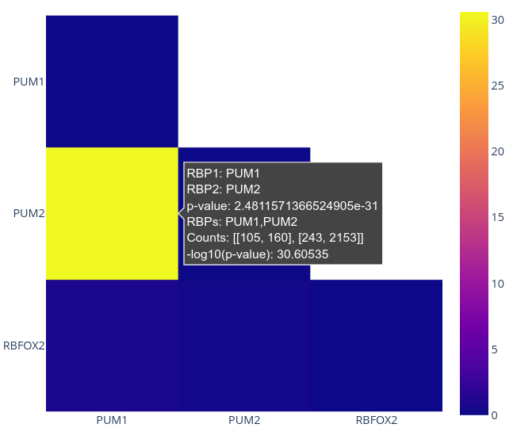
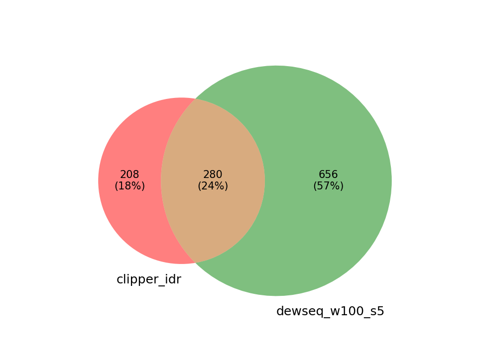
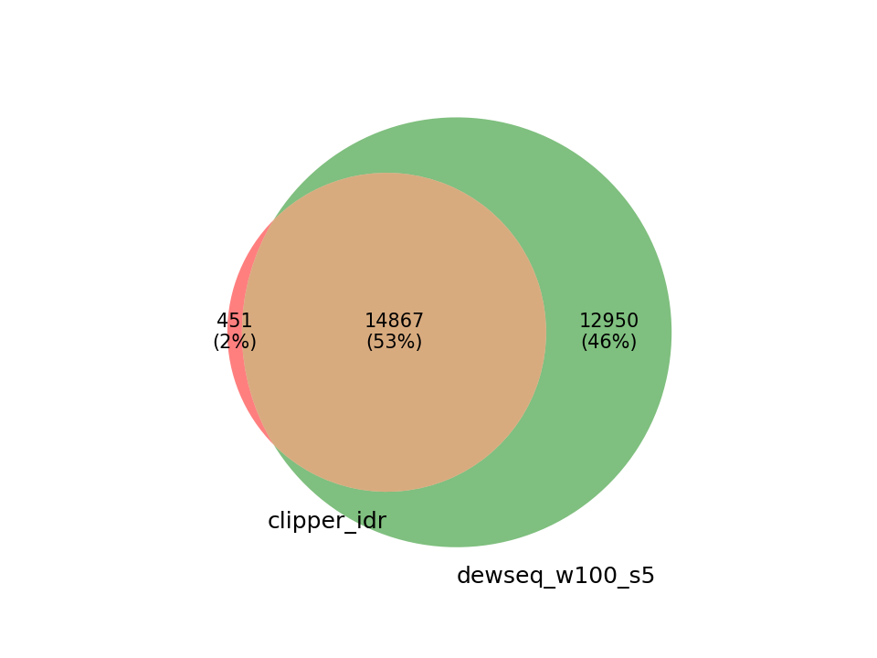
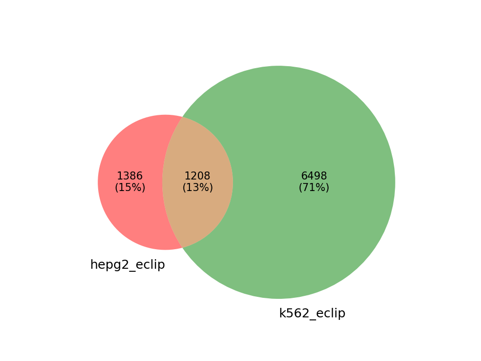
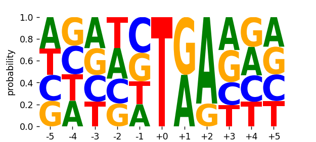

# RBPBench
RBPBench is multi-function tool to evaluate CLIP-seq and other genomic region data 
using a comprehensive collection of known RBP binding motifs. RBPBench can be used for a variety of
purposes, from RBP motif search (database or user-supplied RBPs) in genomic regions, over motif 
co-occurrence analysis, to benchmarking CLIP-seq peak caller methods. 

## Table of contents

- [Introduction](#introduction)
- [Installation](#installation)
    - [Conda](#conda)
    - [Conda package installation](#conda-package-installation)
    - [Manual installation](#manual-installation)
    - [RBPBench on Galaxy](#rbpbench-on-galaxy)
- [Example runs](#example-runs)
    - [Searching for RBP motifs](#searching-for-rbp-motifs)
        - [Search with single RBPs](#search-with-single-rbps)
        - [Informative statistics](#informative-statistics)
        - [Additional search options](#additional-search-options)
        - [Search with multiple RBPs](#search-with-multiple-rbps)
        - [Search with all database RBPs](#search-with-all-database-rbps)
        - [User-provided motif search](#user-provided-motif-search)
        - [Unstranded motif search](#unstranded-motif-search)
    - [Batch-processing multiple datasets](#batch-processing-multiple-datasets)
        - [Multiple BED input files](#multiple-bed-input-files)
        - [Adding more information for comparisons](#adding-more-information-for-comparisons)
    - [Comparisons between search results](#comparisons-between-search-results)
        - [Comparing peak callers](#comparing-peak-callers)
        - [Comparing CLIP-seq datasets](#comparing-clip-seq-datasets)
        - [Comparing multiple results](#comparing-multiple-results)
    - [Additional functions](#additional-functions)
        - [Plot nucleotide distribution at genomic positions](#plot-nucleotide-distribution-at-genomic-positions)
- [Manual](#manual)
    - [Inputs](#inputs)
        - [Genomic regions](#genomic-regions)
        - [Genomic sequence](#genomic-sequence)
    - [Handling genomic overlaps](#handling-genomic-overlaps)
    - [Outputs](#outputs)
        - [Hit statistics table files](#hit-statistics-table-files)
        - [HTML reports](#html-reports)
    - [Troubleshooting](#troubleshooting)
        - [No FIMO hits](#no-fimo-hits)


## Introduction

[CLIP-seq](https://doi.org/10.1038/s43586-021-00018-1) is the by far most common experimental method to identify the RNA binding sites of an RNA-binding protein (RBP) on a transcriptome-wide scale. Various popular protocol variants exist, such as PAR-CLIP, iCLIP, or eCLIP. In order to identify the binding sites from the mapped CLIP-seq read data, tools termed peak callers are applied on the read data. Regions with enriched read numbers in the CLIP-seq libraries (i.e., peak regions), typically compared to one or more control libraries, are subsequently defined as RBP binding sites. Various peak callers exist, applying various techniques in order to define the binding sites.

As no ground truth (i.e., set of true transcriptome-wide binding sites of an RBP) exists, one obvious way to quantify the performance of a peak caller is to look for the enrichment of known RBP binding motifs in the binding site (peak region) data. 
Since there exists no automated solution for this task yet, we implemented RBPBench:
RBPBench is multi-function tool to evaluate CLIP-seq and other genomic region data 
using a comprehensive collection of known high-confidence RBP binding motifs (current release: 259 RBPs comprising 605 motifs). 
RBPBench can be used for benchmarking CLIP-seq peak callers, but it works just as well for other RBP-related research questions:
one can e.g. look for RBP binding motifs in any set of genomic regions (selecting any number of RBPs of interest, including user supplied motifs),
and check for RBP motif co-occurrences (to see which RBPs bind similar regions).
RBPBench is easy to use and freely available via conda (command line usage) or on Galaxy.
Comprehensive statistics and informative plots allow for easy comparisons across multiple RBPs and peak callers.
Last but not least, RBPBench comes with an extensive documentation, including many usage examples.


## Installation

RBPBench was developed and tested on Linux (Ubuntu 22.04 LTS). Currently only Linux operating systems are supported. To install RBPBench, you first need to install the Conda package manager.

### Conda

If you do not have Conda on your system yet, you can e.g. install miniconda, a free + lightweight Conda installer. Get miniconda [here](https://docs.conda.io/en/latest/miniconda.html), choose the latest Miniconda3 Python Linux 64-bit installer and follow the installation instructions. In the end, Conda should be evocable on the command line via (possibly in a different version):

```
$ conda --version
conda 23.7.2
```


### Conda package installation

RBPBench is (soon) available as a Conda package, which makes installation a breeze. 
We simply create a Conda environment and install RBPBench inside the environment:

```
conda create -n rbpbench -c conda-forge -c bioconda
conda activate rbpbench
conda install -c bioconda rbpbench
```

RBPBench should now be available inside the environment:

```
rbpbench -h
```

### Manual installation

Manual installation of RBPBench is only slightly more work. First we create the Conda environment with all necessary dependencies:

```
conda create -n rbpbench -c conda-forge -c bioconda logomaker markdown meme scipy plotly textdistance venn matplotlib-venn infernal bedtools
```

MEME v5 needed / tested.

Next we activate the environment, clone the RBPBench repository, and install RBPBench:

```
conda activate rbpbench
git clone https://github.com/michauhl/RBPBench.git
cd RBPBench
python -m pip install . --ignore-installed --no-deps -vv
```

RBPBench should now be available inside the environment:

```
rbpbench -h
```

### RBPBench on Galaxy

RBPBench will soon be available on Galaxy.


## Example runs

In order to run the examples, we first need to download the human genome sequence:

```
wget https://hgdownload.cse.ucsc.edu/goldenpath/hg38/bigZips/hg38.fa.gz
gunzip hg38.fa.gz
```

We also need some genomic regions to search for motifs. In the examples we mainly use the 
genomic peak regions identified by the eCLIP peak caller CLIPper (IDR method), 
as they are easily available from ENCODE. E.g. for RBP PUM1 (cell type K562):

```
wget https://www.encodeproject.org/files/ENCFF094MQV/@@download/ENCFF094MQV.bed.gz
gunzip -c ENCFF094MQV.bed.gz | awk '{print $1"\t"$2"\t"$3"\t"$4"\t"$7"\t"$6}' > PUM1_K562_IDR_peaks.bed
```

Here we reformatted the peak regions BED, to have 6 columns (6-column BED format), 
with column 5 containing the log2 fold change scores of the peak regions.


### Searching for RBP motifs

#### Search with single RBPs

Let's first check the CLIPper IDR peak regions of the RBP SLBP for motif occurrences. 
For this we first download the peak regions:

```
wget https://www.encodeproject.org/files/ENCFF623WGE/@@download/ENCFF623WGE.bed.gz
gunzip -c ENCFF623WGE.bed.gz | awk '{print $1"\t"$2"\t"$3"\t"$4"\t"$7"\t"$6}' > SLBP_K562_IDR_peaks.bed
```

We can use `rbpbench search` to search for RBP motifs by specifying the RBPs we are interested in.
Here we can specify one RBP or several RBPs from the database, as well as all database RBPs, and 
also user-specified ones (see examples further down). 
For a full list of RBPs currently available for search:

```
rbpbench info
```

Let's first look for SLBP motifs (there is currently one structure motif in the database for SLBP):

```
rbpbench search --in SLBP_K562_IDR_peaks.bed --rbps SLBP --out SLBP_test_search_out --genome hg38.fa
```

Apart from the informative command line output, the search results are stored in two table files:

```
RBP hit stats .tsv:
SLBP_test_search_out/rbp_hit_stats.tsv
Motif hit stats .tsv:
SLBP_test_search_out/motif_hit_stats.tsv
```

The first file (RBP hit stats) contains comprehensive hit statistics for each RBP 
(one row per RBP, see manual below for column descriptions), 
while the motif hits stats file contains hit statistics for each single motif hit 
(one row per motif hit). 
We can see that out of the 161 input regions, 27 contain a motif hit.


#### Informative statistics

RBPBench produces several informative statistics regarding motif hit (co-)occurrences.
The first statistical test (Wilcoxon rank-sum test) 
**checks whether motif hits are more likely in high-scoring input regions**.
By default BED column 5 is used as region scores (set via `--bed-score-col`), which 
can be e.g. log2 fold changes or -log10 p-values. For example, for the above call

```
rbpbench search --in SLBP_K562_IDR_peaks.bed --rbps SLBP --out SLBP_test_search_out --genome hg38.fa
```

we get a significant enrichment of motif hits (Wilcoxon p-value: 6.87978e-09), 
meaning that input regions with SLBP motif hits also feature significantly higher scores.

The second test addresses **RBP motif co-occurrences** (i.e., between two different RBPs), 
using Fisher's exact test. For this a 2x2 contingency table is constructed between 
each input RBP pair, and the co-occurrence information can also be plotted as an interactive heat map (see [example with multiple RBPs](#search-with-multiple-rbps) below). In addition to the co-occurrence statistics, the HTML report also includes a heat map plot of the **correlations between RBPs** (Pearson correlation coefficients). For this genomic input regions are labelled 1 or 0 (RBP motif present or not), resulting in a vector of 1s and 0s for each RBP. Correlations are then calculated by comparing vectors for every pair of RBPs. 


#### Additional search options

There are a number of search options available (check out `rbpbench search -h` and manual below for full descriptions). 
For example, we can extend the given genomic regions, and see how this affects the hit statistics:

```
rbpbench search --in SLBP_K562_IDR_peaks.bed --rbps SLBP --out test_slbp_out --genome hg38.fa --ext 10
```

This extends the genomic regions up- and downstream by 10 nt, and results in 51 hits (from 27 hits without extension). 
Moreover, we can do uneven extension to check whether up- or downstream extension has different effects:

```
rbpbench search --in SLBP_K562_IDR_peaks.bed --rbps SLBP --out test_slbp_out --genome hg38.fa --ext 20,0
rbpbench search --in SLBP_K562_IDR_peaks.bed --rbps SLBP --out test_slbp_out --genome hg38.fa --ext 0,20
```

We note that upstream extension (first command) by 20 nt results in 40 hits, 
while downstream extension (second command) results in 54 hits.
It thus seems that SLBP structure motifs tend to more often reside downstream relative 
to the called peak region (as exemplified in Fig. 3 of [this publication](https://doi.org/10.1016/j.ymeth.2017.02.006)).


#### Search with multiple RBPs

RBPBench can also search for motifs of multiply RBPs in one search run.
For this example we download the PUM1 IDR peak regions:

```
wget https://www.encodeproject.org/files/ENCFF094MQV/@@download/ENCFF094MQV.bed.gz
gunzip -c ENCFF094MQV.bed.gz | awk '{print $1"\t"$2"\t"$3"\t"$4"\t"$7"\t"$6}' > PUM1_K562_IDR_peaks.bed
```

When searching with multiple RBPs, motif hit co-occurences and correlations might become of interest (besides the provided individual RBP statistics). For this we can also output an HTML report file, including hit statistics and interactive plots (`--report`).

```
rbpbench search --in PUM1_K562_IDR_peaks.bed --rbps RBFOX2 PUM1 PUM2 --out test_pum1_out --genome hg38.fa --report
```

The following output files are produced:

```
Co-occurrence p-values for  each RBP pair .tsv:
test_pum1_out/contingency_table_results.tsv
RBP hit stats .tsv:
test_pum1_out/rbp_hit_stats.tsv
Motif hit stats .tsv:
test_pum1_out/motif_hit_stats.tsv
Search report .html:
test_pum1_out/report.rbpbench_search.html
```

The search report `report.rbpbench_search.html` contains a table of motif 
enrichment statistics, as well as the interactive RBP co-occurrences and correlations heat maps.
We can see that PUM1 binding regions with motif hits have significantly higher scores 
(Wilcoxon p-value = 0.00175), and that PUM1 and PUM2 have a significant co-occurrence 
p-value (Fisher's exact test) of 2.48116e-31. In contrast, RBFOX2 co-occurrence p-values
with PUM1 or PUM2 are not significant (0.15234, 0.52303). 
The produced co-occurrence heat map in the report looks the following:



**Fig. 1**: Co-occurrence heat map from `report.rbpbench_search.html`, for the above example (static screenshot, cursor over PUM1-PUM2 RBP pair to get their co-occurrence information). Coloring/scale values are -log10 of Fisher's exact test p-value.

We can see that the interactive co-occurrence heat map gives us the following information for each RBP pair: 
RBP pair IDs, Fisher's exact test p-value (calculated based on contingency table between RBP1 and RBP2), contingency table counts between RBP1 and RBP2, -log10 of Fisher's exact test p-value (used as coloring/scale value). 
The contingency table counts are the numbers of input genomic regions with/without shared motif hits between the compaired RBPs, with the format: [[A, B], [C, D]], where A: RBP1 AND RBP2, B: NOT RBP1 AND RBP2 C: RBP1 AND NOT RBP2 D: NOT RBP1 AND NOT RBP2

Similarly, we can output an HTML report (`motif_plots.rbpbench_search.html`) including the used sequence logos and motif hit statistics (`--plot-motifs`):

```
rbpbench search --in PUM1_K562_IDR_peaks.bed --rbps RBFOX2 PUM1 PUM2 --out test_pum1_out --genome hg38.fa --report --plot-motifs
```

Note that this can take a bit if the whole database (`--rbps ALL`) is used for search (see below).


#### Search with all database RBPs

To use all database RBPs for motif search, we just need to specify `--rbps ALL`:

```
rbpbench search --in SLBP_K562_IDR_peaks.bed --rbps ALL --out SLBP_all_search_out --genome hg38.fa --report
```

This uses all 259 database RBPs (default database: `human_v0.1`, 605 RBP motifs all together). 
Note that SLBP has the lowest Wilcoxon p-value (6.87978e-09) of all 259 RBPs, 
demonstrating the plausibility and usefulness of the provided statistics.


#### User-provided motif search

Both sequence (MEME XML format) and structure (covariance model .CM) motifs can be supplied by the user 
on top of the database RBPs (using `-rbps USER` option together with `-user-meme-xml` or `--user-cm`).
For example, let's supply a structure motif (SLBP) via `--user-cm` (the example motif files can be found in the RBPBench repository subfolder `RBPBench/test`):

```
rbpbench search --in SLBP_K562_IDR_peaks.bed --rbps USER --out SLBP_user_search_out --genome hg38.fa --user-cm path_to_test/SLBP_USER.cm  --user-rbp-id SLBP_USER
```

In the same way, we can supply sequence motif(s) (PUM1) via `--user-meme-xml`, and e.g. also combine it with any of the database RBPs (here PUM2 and RBFOX2):

```
rbpbench search --in PUM1_K562_IDR_peaks.bed --rbps USER PUM2 RBFOX2 --out PUM1_user_search_out --genome hg38.fa --user-meme-xml path_to_test/PUM1_USER.xml --user-rbp-id PUM1_USER
```

#### Unstranded motif search

If you have unstranded genomic regions as input (i.e., strand information is missing), 
you can instruct RBPBench to do an unstranded search by specifying (`-unstranded` option). 
This results in using both strands of the provided regions for motif search. 
Note that for the hit statistics, by default the two strands of a region 
will still be counted as one region (use `--unstranded-ct` to change this behavior). 


### Batch-processing multiple datasets

#### Multiple BED input files

RBPBench also supports batch search, i.e., processing of multiple input files (`rbpbench batch`).

Multiple input BED files can be provided in two ways:
(1) Given a folder containing BED files (.bed extension) via `--bed`, the RBP IDs are expected to be 
the first part of each file name (e.g. for RBP ID RBP1: RBP1.bed, or RBP1_more_info.bed).
(2) Given a list of BED files via `--bed`, the RBP IDs need to be provided (same order!) with `-rbp-list`.

For example, suppose we have a folder `batch_clipper_idr_in` containing the two BED files:

```
$ ls batch_clipper_idr_in/
PUM1_K562_IDR_peaks.bed
PUM2_K562_IDR_peaks.bed
```

Consequently, the two RBP IDs will be `PUM1` and `PUM2`. We can process both of them separately simply by:

```
python rbpbench batch --bed batch_clipper_idr_in --out batch_clipper_idr_out --genome hg38.fa
```

The search results will include all motif hits for RBP `PUM1` (on `PUM1_K562_IDR_peaks.bed`) and 
for RBP `PUM2` (on `PUM2_K562_IDR_peaks.bed`). Alternatively, the same results can be obtained via `-rbp-list`:

```
python rbpbench batch --bed batch_clipper_idr_in/PUM1_K562_IDR_peaks.bed batch_clipper_idr_in/PUM2_K562_IDR_peaks.bed --rbp-list PUM1 PUM2 --out batch_clipper_idr_out --genome hg38.fa
```


#### Adding more information for comparisons

As we also want to compare results of different search runs (using `rbpbench compare`, more details [below](#comparisons-between-search-results)), it makes sense to assign different descriptions or IDs to search runs.
For this RBPBench offers several optional ID arguments (`--data-id`, `--method-id`, `--run-id`).
To quote the help page (`rbpbench search`):

```
  --data-id str         Dataset ID to describe dataset, e.g. --data-id PUM2_eCLIP_K562, used in
                        output tables and for generating the comparison reports (rbpbench compare)
  --method-id str       Method ID to describe peak calling method, e.g. --method-id clipper_idr, used
                        in output tables and for generating the comparison reports (rbpbench compare)
  --run-id str          Run ID to describe rbpbench search job, e.g. --run-id RBP1_eCLIP_tool1, used
                        in output tables and reports
```

These IDs are stored in the output tables together with the hit statistics. 
For example, we can use `eCLIP_K562` as `--data-id` to describe the CLIP experiment and cell type from 
which the input dataset originates from, and `clipper_idr` as `--method-id`, to describe the peak calling 
method which was used to produce the input peak regions. This information can later be used in `rbpbench compare` (details and examples [below](#comparisons-between-search-results)) to define which datasets or conditions should be compared.

In `rbpbench batch` we can also supply lists of IDs (analogous to `--rbp-list` example). 
Again from the help page (`rbpbench batch`):

```
  --data-list str [str ...]
                        List of data IDs to describe datasets given by -bed-list (NOTE: order needs
                        to correspond to --bed order). Alternatively, use --data-id to set method for
                        all datasets
  --data-id str         Data ID to describe data for given datasets, e.g. --method-id k562_eclip,
                        used in output tables and for generating the comparison reports (rbpbench
                        compare)
  --method-list str [str ...]
                        List of method IDs to describe datasets given by -bed-list (NOTE: order needs
                        to correspond to --bed order). Alternatively, use --method-id to set method
                        for all datasets
  --method-id str       Method ID to describe peak calling method for given datasets, e.g. --method-
                        id clipper_idr, used in output tables and for generating the comparison
                        reports (rbpbench compare)
```

We can see that we can either assign single IDs (`--data-id`, `--method-id`) to all search runs 
in the batch, or use their list equivalents (`--data-list`, `--method-list`) to assign IDs 
specific to each run.


### Comparisons between search results

Both single (`rbpbench search`) and batch search (`rbpbench batch`) results 
(i.e., their output folders) can be combined 
and compared using `rbpbench compare`. What is going to be compared is defined by 
the method and data IDs (see [above](#adding-more-information-for-comparisons)) that were 
set for the individual runs. 

#### Comparing peak callers

Suppose we have peak regions (from eCLIP data, K562 cell line) for two RBPs (`PUM1`, `PUM2`), determined by two different peak callers (CLIPper and DEWSeq). The data is stored in two folders (one folder for each peak calling method):

```
$ ls batch_clipper_idr_in/
PUM1_K562_clipper_idr_peaks.bed
PUM2_K562_clipper_idr_peaks.bed
$ ls batch_dewseq_in/
PUM1_K562_dewseq_peaks.bed
PUM2_K562_dewseq_peaks.bed
```

We first process the two folders via `rbpbench batch`, using descriptive data and method IDs (`--data-id k562_eclip --method-id clipper_idr`):

```
rbpbench batch --bed batch_clipper_idr_in --out batch_clipper_idr_out --genome hg38.fa --data-id k562_eclip --method-id clipper_idr  --bed-score-col 5
rbpbench batch --bed batch_dewseq_in --out batch_dewseq_out --genome hg38.fa --data-id k562_eclip --method-id dewseq_w100_s5 --bed-score-col 7
```

Note that we set `--bed-score-col` depending on which column stores the BED region score (more details [above](#informative-statistics)). For DEWSeq, we also added information about used settings to the method ID (windows size of 100, step size of 5).

Now we can compare the results of the two peak calling methods (method IDs `clipper_idr` and `dewseq_w100_s5`) simply by:

```
rbpbench compare --in batch_clipper_idr_out/ batch_dewseq_out/ --out compare_clipper_dewseq_out
```

This produces an HTML report (`compare_clipper_dewseq_out/report.rbpbench_compare.html`), 
containing method comparison statistics (tables and plots). 

In this example, we have two RBPs and two peak calling methods to compare, resulting in 
2 method comparisons (one for RBP `PUM1`, one for RBP `PUM2`).
Thus, a method comparison statistics table and a Venn diagram is created for each RBP in the HTML report file.
The table contains the following column metrics (extracted from the input folder RBP hit statistics files): 


| Column name | Description |
|:--------------:|:--------------:|
| Method ID | Method ID set for dataset (typically peak calling method ID) |
| # regions | Number of peak regions used for motif search |
| # motif hits | Number of unique motif hits in peak regions (removed double counts) |
| % regions with motifs | Percentage of peak regions with motif hits |
| % motif nucleotides | Percentage of unique motif nucleotides over effective peak region size (overlapping regions merged) |
| # motif hits per 1000 nt | Number of motif hits over 1000 nt of called peak region size (overlapping regions NOT merged) |

This information sums up the performance of the peak calling method, using the motif hit statistics
as performance metrics. In our example, we get the following table for `PUM1`:

| Method ID | # regions | # motif hits | % regions with motifs | % motif nucleotides | # motif hits per 1000 nt |
|:--------------:|:--------------:|:--------------:|:--------------:|:--------------:|:--------------:|
| clipper_idr | 2661 | 488 | 13.08 | 2.12 | 3.03 |
| dewseq_w100_s5 | 1583 | 936 | 29.88 | 2.59 | 3.65 |

We can see that for the PUM1 dataset, 29.88 % of DEWSeq peak regions contain >= 1 PUM1 motif hit (CLIPper IDR 13.08 %). We can also see that the number of motif hits over 1,000 nt called peak region size is higher for DEWSeq (3.65 vs. 3.03).

As any given genomic motif hit can either be found only by one method, or be identified by any set (>=2) of methods, it makes sense to visualize this information as a Venn diagram. 
In the `PUM1` example, the produced Venn diagram looks like this:




**Fig. 2**: Venn diagram of motif hits by peak calling methods CLIPper IDR and DEWSeq (PUM1 eCLIP K562 data). 
Motif hit numbers and percentages of total motif hits are shown for each region (method exclusive and intersection).

We can see that the overlap is not particularly high for the PUM1 dataset. In contrast, the overlap is higher for the `PUM2` dataset:



**Fig. 3**: Venn diagram of motif hits by peak calling methods CLIPper IDR and DEWSeq (PUM2 eCLIP K562 data). 
Motif hit numbers and percentages of total motif hits are shown for each region (method exclusive and intersection).


#### Comparing CLIP-seq datasets

Besides comparing peak callers, we can also do other comparisons, based on the set 
data IDs during search (`--data-id`). For example, we can compare peak regions 
called with the same peak caller on two different cell lines. For this we first 
download the eCLIP peak regions called by CLIPper IDR (RBP: RBFOX2, cell lines: K562, HepG2):

```
wget https://www.encodeproject.org/files/ENCFF206RIM/@@download/ENCFF206RIM.bed.gz
gunzip -c ENCFF206RIM.bed.gz | awk '{print $1"\t"$2"\t"$3"\t"$4"\t"$7"\t"$6}' > RBFOX2_K562_IDR_peaks.bed
wget https://www.encodeproject.org/files/ENCFF871NYM/@@download/ENCFF871NYM.bed.gz
gunzip -c ENCFF871NYM.bed.gz | awk '{print $1"\t"$2"\t"$3"\t"$4"\t"$7"\t"$6}' > RBFOX2_HepG2_IDR_peaks.bed
```
Next we search for motifs in both using `rbpbench batch`:

```
rbpbench batch --bed RBFOX2_HepG2_IDR_peaks.bed RBFOX2_K562_IDR_peaks.bed --genome hg38.fa --rbp-list RBFOX2 RBFOX2 --data-list k562_eclip hepg2_eclip --method-id clipper_idr --out rbfox2_clipper_idr_batch_out
```

And for the comparison:

```
rbpbench compare --in rbfox2_clipper_idr_batch_out --out rbfox2_clipper_idr_compare_out
```

This gives us one dataset comparison (RBP: RBFOX2, data IDs `k562_eclip` and `hepg2_eclip`), 
with the resulting table:

| Data ID | # regions | # motif hits | % regions with motifs | % motif nucleotides | # motif hits per 1000 nt |
|:--------------:|:--------------:|:--------------:|:--------------:|:--------------:|:--------------:|
| k562_eclip | 7477 | 7706 | 41.65 | 4.32 | 14.48 |
| hepg2_eclip | 3525 | 2594 | 29.33 | 2.93 | 9.81 |

We can see that the eCLIP data from the K562 cell line in general contains more 
motif hits (absolute and percentage-wise), 
which can hint at the quality of the experimental data.

Moreover, looking at motif hits common between or exclusive to one of the two datasets, 
the produced Venn diagram looks the following:




**Fig. 4**: Venn diagram of motif hits for RBFOX2 in two cell lines HepG2 and K562 (peak calling method CLIPper IDR).
Motif hit numbers and percentages of total motif hits are shown for each region (method exclusive and intersection).


#### Comparing multiple results

Any number of `rbpbench search` or `rbpbench batch` output folders can be input 
at the same time to `rbpbench compare`, creating one combined report (using the found data IDs 
and method IDs to define data and/or method comparisons):

```
rbpbench compare --in rbfox2_clipper_batch_out/ batch_clipper_idr_out/ batch_dewseq_out/ --out compare_merged_out
```


### Additional functions

#### Plot nucleotide distribution at genomic positions

We can use `rbpbench dist` to plot the nucleotide distribution at genomic positions.
This can be used e.g. to check for potential nucleotide biases at CLIP-seq crosslink positions.
For illustration, we use genomic stop codon positions obtained from [ENSEMBL transcript
annotations](https://www.ensembl.org/info/data/ftp/index.html):

```
rbpbench dist --in stop_codons.Homo_sapiens.GRCh38.110.bed --genome hg38.fa --out test_dist_out --ext 5
```

By default the upstream start position of the genomic input regions is used as 
position zero in the plot (change with `--cp-mode` option). The amount of up- and 
downstream context added is defined by `--ext`. 
The generated plot (`test_dist_out/nt_dist_zero_pos.png`) looks the following:



**Fig. 5**: Nucleotide distribution (position probability matrix) at genomic stop codon positions (human transcript annotations, ENSEMBL GRCh38 release 110).

We can clearly identify the known stop codon triplet sequences (in DNA: TAA, TAG, TGA), starting 
at position 0.


## Manual

RBPBench is a multi-function tool. To get an overview of the currently available 
functions (or modes), we can type:

```
$ rbpbench -h
usage: rbpbench [-h] [-v] {search,batch,optex,info,dist,compare} ...

Evaluate CLIP-seq and other genomic region data using a comprehensive
collection of known RBP binding motifs (RNA sequence + structure). RBPBench
can be used for a variety of purposes, from RBP motif search in genomic
regions, over motif co-occurence analysis, to benchmarking CLIP-seq peak
callers.

positional arguments:
  {search,batch,optex,info,dist,compare}
                        Program modes
    search              Search motifs in genomic sites
    batch               Find motifs on > 1 dataset
    optex               Investigate optimal extension
    info                Print out RBP IDs in database
    dist                Plot nt distribution at genomic positions
    compare             Compare different search results

options:
  -h, --help            show this help message and exit
  -v, --version         show program's version number and exit

```

There are currently six modes available: 
`rbpbench search`, `rbpbench batch`, `rbpbench optex`, `rbpbench info`, 
`rbpbench dist`, and `rbpbench compare`.


### Inputs


#### Genomic regions

Genomic input regions have to be provided in BED format. The first 6 columns 
are mandatory and are expected to mean the following: chromosome ID, 
genomic region start position (0-based index),
genomic region end position (1-based index), 
region ID, region score, region strand (plus(+) or minus(-) strand).
If the genomic regions should be treated as unstranded (`--unstranded` enabled), 
the region strand information will be ignored, and both strands will be used for motif search.
For a valid example from one of our example runs:

```
$ head -5 PUM1_K562_IDR_peaks.bed 
chr20	62139082	62139128	PUM1_K562_IDR	3.43241573178832	-
chr20	62139146	62139197	PUM1_K562_IDR	3.35874858317445	-
chr7	6156853	6157005	PUM1_K562_IDR	4.85347590189745	+
chr15	82404676	82404753	PUM1_K562_IDR	4.1721908622051	+
chr1	19094999	19095025	PUM1_K562_IDR	5.11052671530143	-
```

Additional columns (> 6) will be ignored, although the region score column 
can be different from column 5 (default). You can specify which column should be used 
as region score (for Wilcoxon rank sum test) via `--bed-score-col`.

Before motif search, the input regions are filtered and optionally extended (`--ext` option).
Regions with invalid chromosome IDs (i.e., not present in the genome sequence file `-genome`) 
are removed. Furthermore, duplicated regions are merged into one region (same chromosome ID + start + end + strand).
The command line output also informs about these:

```
# --in regions pre-filtering:   2661
# --in regions post-filtering:  2661
# regions with invalid chr_id:  0
# duplicated regions removed:   0
```


#### Genomic sequence

Genomic sequences have to be provided in FASTA format. For example, the human 
genome sequence (`hg38.fa`) can be obtained from [here](https://hgdownload.cse.ucsc.edu/goldenpath/hg38/bigZips).
To download in the command line and unpack:

```
wget https://hgdownload.cse.ucsc.edu/goldenpath/hg38/bigZips/hg38.fa.gz
gunzip hg38.fa.gz
```

### Handling genomic overlaps

As input genomic regions can overlap (also due to extending them via `--ext`), RBPBench 
considers both the called genomic region size as well as the effective genomic 
region size. While the called size ignores overlaps, the effective size 
only counts unique input regions (i.e., merging overlapping parts, only counting
them once). This also holds for the reported motif hits, where **unique** counts 
refer to effective counts. For example, a motif located at a specific genomic position 
can appear several times in the input data. The unique count takes care of this 
and counts it only once. This is important e.g. when comparing the results 
of different peak callers. Another interesting statistic (full list of statistics and descriptions [here](#hit-statistics-table-files)) 
is e.g. the number of unique motif hits over 1000 nt of called and effective region size. 
This gives us an idea of how many motifs are included in the regions, normalized over 
the total size of the regions (called or effective size).


### Outputs


RBP binding motif hit statistics are output into table files and (optionally) HTML reports (including additional plots such as co-occurrence heat maps).


#### Hit statistics table files

In search and batch search (`rbpbench search`, `rbpbench batch`), RBPBench 
outputs the RBP binding motif hit statistics into two table files stored in the results output folder (defined by `--out`):

```
RBP hit stats .tsv:
results_output_folder/rbp_hit_stats.tsv
Motif hit stats .tsv:
results_output_folder/motif_hit_stats.tsv
```

The first file (RBP hit stats) contains comprehensive hit statistics for each RBP 
(one row per RBP, see manual below for column descriptions), 
while the motif hits stats file contains hit statistics for each single motif hit 
(one row per motif hit).

The RBP hit statistics file `rbp_hit_stats.tsv` contains the following columns:


| Column name | Description |
|:--------------:|:--------------:|
| data_id | Set Data ID (`--data-id`). More [here](#adding-more-information-for-comparisons) |
| method_id | Set method ID (`--method-id`). More [here](#adding-more-information-for-comparisons) |
| run_id | Set run ID (`--run-id`) |
| motif_db | Selected motif database for search (`--motif-db`) |
| rbp_id | RBP ID (i.e., RBP name), e.g. `PUM1` |
| c_regions | Number of input genomic regions used for search (after filtering and extension operations) |
| mean_reg_len | Mean length of genomic regions |
| median_reg_len | Median length of genomic regions |
| median_reg_len | Median length of genomic regions |
| min_reg_len | Minimum length of genomic regions |
| called_reg_size | Called size of genomic regions (including overlaps) |
| effective_reg_size | Effective size of genomic regions (removed overlaps) |
| c_reg_with_hits | Number of regions with motif hits from rbp_id |
| perc_reg_with_hits | Percentage of regions with motif hits from rbp_id |
| c_motif_hits | Total number of motif hits from rbp_id |
| c_uniq_motif_hits | Number of unique motif hits from rbp_id (removed double counts) |
| c_uniq_motif_nts | Number of unique motif nucleotides from rbp_id (removed overlaps) |
| perc_uniq_motif_nts_cal_reg | Percentage of unique motif nucleotides over called region size |
| perc_uniq_motif_nts_eff_reg | Percentage of unique motif nucleotides over effective region size |
| uniq_motif_hits_cal_1000nt | Number of motif hits over 1000 nt of called region size |
| uniq_motif_hits_eff_1000nt | Number of motif hits over 1000 nt of effective region size |
| wc_pval | [Wilcoxon rank-sum test p-value](#informative-statistics) to test whether motif hit regions also feature higher scores | 
| seq_motif_ids | Sequence motif IDs. Empty (`-`) if rbp_id has not sequence motifs  | 
| seq_motif_hits | Sequence motif hit counts (count for each motif ID) | 
| str_motif_ids | Structure motif IDs. Empty (`-`) if rbp_id has not structure motifs  | 
| str_motif_hits | Structure motif hit counts (count for each motif ID) | 
| internal_id | Internal ID (unique for each rbp_id run), used for connecting table results  | 


The motif hit statistics file `motif_hit_stats.tsv` contains the following columns:

| Column name | Description |
|:--------------:|:--------------:|
| data_id | Set Data ID (`--data-id`). More [here](#adding-more-information-for-comparisons) |
| method_id | Set method ID (`--method-id`). More [here](#adding-more-information-for-comparisons) |
| run_id | Set run ID (`--run-id`) |
| motif_db | Selected motif database for search (`--motif-db`) |
| region_id | Genomic region ID containing the hit, e.g. `chr1:228458485-228458560(+)` |
| rbp_id | RBP ID (i.e., RBP name), e.g. `SLBP` |
| motif_id | Motif ID |
| chr_id | chromosome ID |
| gen_s | genomic motif hit start (1-based) |
| gen_e | genomic motif hit end (1-based) |
| strand | Chromosome strand (+ or - strand) |
| region_s | region motif hit start (1-based) |
| region_e | region motif hit end (1-based) |
| region_len | Region length |
| uniq_count | Unique motif hit count |
| fimo_score | FIMO score (for sequence motif hits) |
| fimo_pval | FIMO p-value (for sequence motif hits) |
| cms_score | cmsearch score (for structure motif hits) |
| cms_eval | cmsearch e-value (for structure motif hits) |
| internal_id | Internal ID (unique for each rbp_id run), used for connecting table results  | 

										
#### HTML reports

HTML reports containing additional statistics and plots are available in search and 
compare mode (`rbpbench search`, `rbpbench compare`). Contents of the `rbpbench compare` 
HTML report are described [here](#comparing-peak-callers). In `rbpbench search`, 
two HTML report files can be generated (`--report` and `--plot-motifs`). Their contents
are described in the example section [above](#search-with-multiple-rbps).


### Troubleshooting

#### No FIMO hits

This can e.g. happen if you have an old MEME version installed (v4). RBPBench was implemented using v5, so please install MEME v5 (e.g. 5.5.3).

