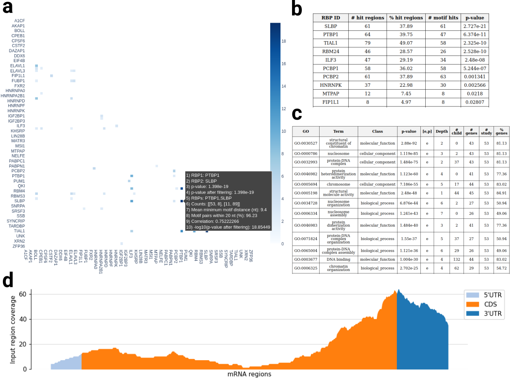
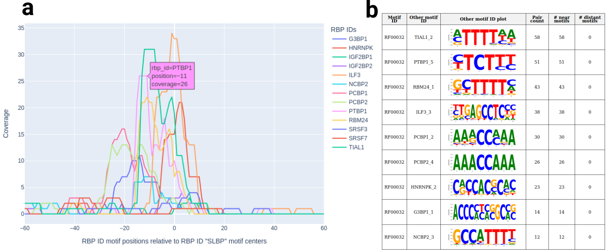

# RBPBench

[](https://github.com/michauhl/RBPBench)
[](https://anaconda.org/bioconda/rbpbench)

RBPBench is multi-function tool to evaluate CLIP-seq and other genomic region data 
using a comprehensive collection of known RNA-binding protein (RBP) binding motifs. 
RBPBench can be used for a variety of purposes, from RBP motif search (database or 
user-supplied RBPs) in genomic regions, over motif enrichment and co-occurrence analysis, 
to benchmarking CLIP-seq peak caller methods as well as comparisons across cell types 
and CLIP-seq protocols. RBPBench supports both sequence and structure motifs,
as well as regular expressions. Moreover, users can easily provide their own 
motif collections.


## Table of contents

- [Installation](#installation)
    - [Conda](#conda)
    - [Conda package installation](#conda-package-installation)
    - [Manual installation](#manual-installation)
- [Example runs](#example-runs)
    - [Motif search with single input dataset](#motif-search-with-single-input-dataset)
    - [Motif search with multiple input datasets](#motif-search-with-multiple-input-datasets)
    - [Comparisons between search results](#comparisons-between-search-results)
    - [Single motif enrichment and co-occurrences](#single-motif-enrichment-and-co-occurrences)
    - [Visualizing global motif preferences](#visualizing-global-motif-preferences)
    - [Additional modes](#additional-modes)
- [Documentation](#documentation)
    - [Program modes](#program-modes)
    - [Inputs](#inputs)
    - [Outputs](#outputs)
    - [Statistics](#statistics)
    - [Additional information](#additional-information)

## Installation

RBPBench was developed and tested on Linux (Ubuntu 22.04 LTS). Currently only Linux operating systems are supported. To install RBPBench, you first need to install the Conda package manager.

### Conda

If you do not have Conda on your system yet, you can e.g. install Miniconda, a free + lightweight Conda installer. Get Miniconda [here](https://docs.conda.io/en/latest/miniconda.html), choose the latest Miniconda3 Python Linux 64-bit installer and follow the installation instructions. In the end, Conda should be evocable on the command line via (possibly in a different version):

```
$ conda --version
conda 24.5.0
```


### Conda package installation

RBPBench is available as a Conda package, which makes installing a breeze. 
We simply create a Conda environment and install RBPBench inside the environment:

```
conda create -n rbpbench -c conda-forge -c bioconda rbpbench
conda activate rbpbench
```

RBPBench should now be available inside the environment:

```
rbpbench -h
```

### Manual installation

Manual installation of RBPBench is only slightly more work. First we create the Conda environment with all necessary dependencies:

```
conda create -n rbpbench -c conda-forge -c bioconda logomaker markdown meme scipy plotly textdistance venn matplotlib-venn infernal bedtools upsetplot scikit-learn goatools python=3.11
```

Next we activate the environment, clone the RBPBench repository, and install RBPBench:

```
conda activate rbpbench
git clone https://github.com/michauhl/RBPBench.git
cd RBPBench
python -m pip install . --ignore-installed --no-deps -vv
```

RBPBench should now be available inside the environment:

```
rbpbench -h
```

### RBPBench webserver

RBPBench is also available as a webserver on Galaxy (more infos soon).


## Example runs

To run the examples, we change to the cloned repository subfolder `RBPBench/test`
and download the genome FASTA file ([details](#genomic-sequences)) and a 
fitting GTF file, e.g. from Ensembl ([details](#genomic-annotations)):

```
cd test/
wget https://hgdownload.cse.ucsc.edu/goldenpath/hg38/bigZips/hg38.fa.gz
gunzip hg38.fa.gz
wget https://ftp.ensembl.org/pub/release-112/gtf/homo_sapiens/Homo_sapiens.GRCh38.112.gtf.gz
```

We also unzip the collection of [ENCODE](https://www.encodeproject.org/) eCLIP CLIPper IDR peak 
region BED files (i.e., genomic RBP binding regions determined by CLIPper IDR method on RBP-specific eCLIP data), 
which we will use as example input files to demonstrate the various RBPBench modes:

```
unzip eclip_clipper_idr.zip
```

The folder content looks like this:

```
ls -1 eclip_clipper_idr
AGGF1_HepG2_IDR_peaks.bed
AGGF1_K562_IDR_peaks.bed
AKAP1_HepG2_IDR_peaks.bed
AKAP1_K562_IDR_peaks.bed
...
```

We can see that we have a total of 172 genomic region files to work with, comprised of 88 for K562 cell line, 
84 for HepG2 cell line, and a total of 110 different RBPs over the two cell lines:

```
ls -1 eclip_clipper_idr | wc -l
172
ls -1 eclip_clipper_idr | grep -c "K562"
88
ls -1 eclip_clipper_idr | grep -c "HepG2"
84
ls eclip_clipper_idr | cut -d'_' -f1 | sort | uniq | wc -l
110
```


### Motif search with single input dataset

#### Search with selected RBPs

For motif search in a single set of genomic input regions (typically CLIP-seq peak regions), 
we can use `rbpbench search` mode. This mode contains many useful functions 
and command line options (please check out the help prompt `rbpbench search -h` 
as well as the [documentation](#documentation) below for more details on the 
various functionalities of the different modes). In this first example, we take 
PUM2 eCLIP regions and search for motifs of PUM1, PUM2, RBFOX2 (see `rbpbench info` for 
all available RBPs), as well as the regular expression `AATAAA` (known polyadenylation signal sequence, more on regex use [here](#motifs)):

```
rbpbench search --in eclip_clipper_idr/PUM2_K562_IDR_peaks.bed --genome hg38.fa --gtf Homo_sapiens.GRCh38.112.gtf.gz --out test_search_pum2_ex1_out --rbps PUM2 PUM1 RBFOX2 --ext 10 --regex AATAAA
```

Here we also extend the input regions by 10 nt up- and downstream (`--ext 10`, for different up- and downstream use e.g. `--ext 0,20`) before search. 
**Fig. 1** shows the plots generated in this example (found in HTML report file `report.rbpbench_search.html`, additional plots can be 
generated e.g. via `--enable-upset-plot`, `--set-rbp-id`). Detailed explanations on plot contents can be found in the generated HTML file. 
Note that apart from HTML reports, RBPBench also outputs various table files (e.g., motif hit regions, region annotations, RBP + motif hit statistics, 
more details e.g. [here](#hit-statistics-table-files)), which can later be used for comparing search results or again as input regions for motif search.


**Fig. 1**: Example visualizations produced by `rbpbench search` (PUM2 example). 
**a:** RBP motif co-occurrences heat map. 
**b:** Input sequence length distribution plot.
**c:** Exon-intron overlap statistics.
**d:** Region annotations per RBP.
**e:** mRNA region coverage profile.
Note that for plotting purposes the interactive plots (here and subsequent figures) appear more cramped than in the HTML reports.

**Fig. 1a** shows the RBP motif co-occurrences heat map (color scale values are -log10 of Fisher's exact test p-value), 
visualizing significant RBP motif co-occurrences ([details](#co-occurrence-statistics)). 
We can see that PUM2 and PUM1 binding motifs frequently co-occur, which makes sense since their database motifs are very similar 
(to visualize all selected RBP motifs in HMTL, add `--plot-motifs` and 
inspect `motif_plots.rbpbench_search.html`, example entry shown in **Fig. 2**). 
We also see significant co-occurrences of `AATAAA` regex hits with PUM2 and PUM1, which too is reasonable since 
PUM2 binding sites tend to be in 3'UTR regions, often also towards their ends (as showcased in **Fig. 1e**).
In contrast, RBFOX2 motif hits are less frequent and show no significant co-occurrence (expected since RBFOX2 
is known to be involved in splicing regulation). **Fig. 1b** shows the distribution of input sequence lengths, including 
the sequences and motif hits for each sequence. **Fig. 1c** provides exon-intron overlap statistics of the input regions, 
including exon-intron border regions. **Fig. 1d** shows genomic region annotations for all input regions (add `--add-all-reg-bar`), 
as well as the regions with motif hits for each specified RBP. **Fig. 1e** displays the coverage of mRNA regions (5'UTR, CDS, 3'UTR) 
by the input regions. All three plots (**Fig. 1c-e**) confirm PUM2's known binding preferences 
(namely spliced exonic RNA, specifically 3'UTR regions).


**Fig. 2**: Example entry for RBP RBFOX2 from `motif_plots.rbpbench_search.html`. 
The `--plot-motifs` HTML report visualizes the selected motifs, provides literature references, 
as well as motif hit counts and genomic region annotations for the motif hit regions themselves.


#### Search with all RBPs

To search with all database RBP motifs in a single set of genomic input regions, we can use `--rbps ALL`. 
The motif database can be changed via `--motif-db` (details on motif selection [here](#motifs)), and the user can also define 
own motifs or even a motif database ([details](#custom-motif-database)). Moreover, the selected RBPs can be filtered by
annotated functions (`--functions`, [details](#rbp-functions)). For this example we use the SLBP eCLIP regions, 
select all RBPs, further filter them by some annotated functions, and also conduct a GO term enrichment analysis 
on the input regions:

```
rbpbench search --in eclip_clipper_idr/SLBP_K562_IDR_peaks.bed --genome hg38.fa --gtf Homo_sapiens.GRCh38.112.gtf.gz --out test_search_slbp_tr_rsd_tep_out --functions TR RSD TEP --rbps ALL --ext 20 --goa
```

Here we filter the selected RBPS (i.e., all RBPs) to keep only RBPs with the following annotated functions: translation regulation (TR),
RNA stability & decay (RSD), 3' end processing (TEP). This results in 91 RBPs for search (out of 257), 
with 260 motifs (out of 599). 



**Fig. 3**: Example visualizations and statistics produced by `rbpbench search` (SLBP example). 
**a:** RBP motif co-occurrences heat map. 
**b:** RBP region score motif enrichment statistics (top 10).
**c:** GO enrichment analysis results.
**d:** mRNA region coverage profile.

**Fig. 3** shows some of the resulting plots and statistics from the HTML report. 
**Fig. 3a** again shows the RBP motif co-occurrences heat map, this time between the 91 selected RBPs.
**Fig. 3b** presents the RBP region score motif enrichment statistics table ([details](#input-region-score-motif-enrichment-statistics)).
This in short checks whether any of the RBP motifs (on RBP level) tend to occur more often in higher scoring input regions. 
As default, BED column 5 is used as score (change via `--bed-score-col`), which in the input examples is the log2 fold change of 
the CLIP-seq peak region. We can see that SLBP has the lowest p-value here, 
as expected (assuming that the region score is to some extent indicative of binding site quality 
or binding affinity), showing that the statistic can be useful e.g. to check for 
dataset quality, or for co-enriched RBP motifs. Region scores can be further taken advantage of by comparing k-mer distributions 
of top and bottom scoring input regions ([details](#comparing-top-scoring-and-bottom-scoring-sites-via-k-mer-distribution)).
**Fig. 3c** shows the GO term enrichment analysis results.
As expected for SLBP, we can see many chromatin related terms in the top GO terms (more on GOA settings [here](#go-term-analysis)).
**Fig. 3d** again depicts the mRNA region coverage profile, this time for SLBP (see **Fig. 1e** for PUM2 profile). 
Note that the relative mRNA region lengths in the plot can change, depending on the number of input regions and on 
which mRNAs these map. Also note that this plot becomes less informative if the percentage of input regions mapping to mRNA regions 
gets lower (info given in HTML figure legend, here: 82.0%). Most often, this is the case for intron-binding RBPs, where you typically
have low percentages of exonic regions and thus also low mRNA coverage.

To take a closer look at how motif hits are distributed around a specific RBP, we can specify the RBP to focus on via `set-rbp-id`:

```
rbpbench search --in eclip_clipper_idr/SLBP_K562_IDR_peaks.bed --genome hg38.fa --gtf Homo_sapiens.GRCh38.112.gtf.gz --out test_search_slbp_tr_rsd_tep_gh_out --functions TR RSD TEP  --rbps ALL --ext 20 --set-rbp-id SLBP --greatest-hits
```

Here we also enable `--greatest-hits`, meaning that for each input region and RBP only the motif hit with the 
lowest p-value gets reported. This has an impact on the co-occurrence heat map statistics, namely through 
changing the mean minimum motif distance (if we want to filter by this via setting `--min-motif-dist` to > 0, 
[details](#co-occurrence-statistics)), but also on the distance plots that get produced in the example (**Fig. 4**).
This way we can focus for each RBP motif on the best motif hit for each input region (by default all 
hits are included in the outputs and analysis).



**Fig. 4**: Example visualizations and statistics produced by `rbpbench search` (SLBP example with `--set-rbp-id`). 
**a:** Set RBP SLBP motif distances plot. 
**b:** Motif distance statistics table.

**Fig. 4a** shows the distances of other RBP motifs relative to the set RBP (SLBP here), resulting in a 
coverage plot for each RBP that passes the filter thresholds (default minimum motif pair count 10, set via `--rbp-min-pair-count`).  
This plot is generated both on the RBP level, but also on the single RBP motif level (so for each motif associated 
with the set RBP, **Fig. 4a** shows RBP level). 
**Fig. 4b** shows the RBP motifs most frequently observed in the neighborhood of the set RBP (here on motif level).
These plots give us an idea which motifs occur at which distances in the input regions. 
To get a more fine-grained picture of co-occurrences on the single motif level, 
including signifying motif enrichment in input regions, 
we can use `rbpbench enmo` or `rbpbench nemo` (more details in the examples below and [here](#motifs)). 
Alternatively, single motifs can be selected in the various search modes using `--motifs` followed 
by the motif ID(s) of interest. For example, to select only the first two PUM2 motifs for search out of 
all selected RBP motifs:

```
rbpbench search --in eclip_clipper_idr/PUM2_K562_IDR_peaks.bed --genome hg38.fa --gtf Homo_sapiens.GRCh38.112.gtf.gz --out test_search_pum2_1_2_out --rbps ALL --ext 10 --motifs PUM2_1 PUM2_2
```


### Motif search with multiple input datasets

RBPBench also supports batch processing of multiple input datasets (`rbpbench batch`), i.e., 
to run motif search on multiple input datasets.
This allows us to learn more about 
general, group- or set-specific features for a large number of CLIP-seq (or similar methods) datasets, 
by inspecting the generated HTML batch report plots and statistics.
In addition, it can be used to generate the input files for benchmarking peak callers, 
or to e.g. do CLIP-seq protocol or cell type comparisons, using `rbpbench compare`.

A batch of input BED regions can be provided to `rbpbench batch` in several ways, e.g. completely via the command line.
However, for a large set of input datasets, the easiest way is to provide a table file where one specifies
the RBP used for search, the method ID and the data ID (to define what gets compared in `rbpbench compare`), and the path 
to the BED file. For example, the first three lines of our K562 (a cell type) eCLIP example table file look like this:

```
head -3 eclip_clipper_idr.k562.batch_in.txt
AGGF1	clipper_idr	K562_eclip	eclip_clipper_idr/AGGF1_K562_IDR_peaks.bed
AKAP1	clipper_idr	K562_eclip	eclip_clipper_idr/AKAP1_K562_IDR_peaks.bed
BUD13	clipper_idr	K562_eclip	eclip_clipper_idr/BUD13_K562_IDR_peaks.bed
```

To run `rbpbench batch` on all the 88 K562 eCLIP sets (one line per set) specified in the table file:

```
rbpbench batch --bed eclip_clipper_idr.k562.batch_in.txt --genome hg38.fa --gtf Homo_sapiens.GRCh38.112.gtf.gz --ext 10 --out batch_K562_eclip_clipper_idr_out --regex AATAAA
```

Note that we again use a regex, which conveniently allows us to check enrichment and co-occurrences of this regex in all input datasets. 
Also note that many of the generated batch statistics and plots are independent of motif hit statistics, i.e., they rather look 
at genomic annotations, occupied genes, or sequence content of input regions. This makes `rbpbench batch` a great solution for 
comparing a large number of existing CLIP-seq datasets to a specific dataset of your interest (e.g., also derived from CLIP-seq or similar protocols), 
to quickly check for differences and similarities between the datasets.
The output results folder again contains several table files (e.g., the hit statistics files used as inputs to `rbpbench compare`, [details](#hit-statistics-table-files)),
as well the HTML report file `report.rbpbench_batch.html`, containing various comparative plots and statistics. 
For the example call above, the following statistics and plots are included in the HTML report file:

1. Input datasets sequence length statistics table
2. Input datasets exon-intron overlap statistics table
3. Input datasets region score motif enrichment statistics table
4. Regular expression region score motif enrichment statistics table
5. Regular expression RBP motif co-occurrence statistics table
6. Input datasets k-mer frequencies comparative plot
7. Input datasets occupied gene regions comparative plot
8. Input datasets occupied gene regions similarity heat map
9. Input datasets genomic region annotations comparative plot
10. Plus a genomic regions annotation plot for each input dataset

Detailed explanations can be found in the corresponding table and plot legends in the HTML file. 
**Fig. 5** shows the 4 plots produced by the above call:


**Fig. 5**: Example visualizations and statistics produced by `rbpbench batch` (K562 eCLIP datasets example). 
**a:** Input datasets k-mer frequencies comparative plot.
**b:** Input datasets occupied gene regions comparative plot.
**c:** Input datasets occupied gene regions similarity heat map.
**d:** Input datasets genomic region annotations comparative plot.

**Fig. 5a** plot compares the input datasets by the k-mer frequencies of their site sequences 
(by default 5-mer frequncies, change via `--kmer-size`, 3D-PCA dimensionality reduction). 
In addition, for each dataset, the top 10 5-mer frequencies are given in the hover box. This way 
we can quickly assess sequence similarities and dissimilarities between input datasets, 
or e.g. spot interesting outliers.
**Fig. 5b** plot again uses 3D-PCA, this time on the occupied gene regions for each input dataset.
Here we can quickly identify e.g. datasets with very low numbers of occupied genes, or in general 
datasets with similar gene occupancy profiles.
**Fig. 5c** further expands on occupied genes statistics, this time using the cosine similarity 
to measure the similarity in occupied genes between datasets. In addition, the datasets are ordered 
based on hierarchical clustering, resulting in similar datasets appearing close together on the axes.
This allows us to identify groups of datasets which have similar occupancy profiles.
**Fig. 5d** gives us the genomic region annotations for each input dataset, using 2D-PCA to 
reduce dimensions. Moreover, datasets are colored by the highest percentage annotation, allowing 
us to identify groups of input datasets with similar binding characteristics (e.g., the blue dots 
represent datasets whose regions primarily overlap with 3'UTR regions). If a regex is supplied, 
this also shows up here, meaning over all datasets, the regex hit regions are annotated 
and appear in the plot.


### Comparisons between search results

To compare peak calling methods or in general conditions based on motif hit results, we can use the RBPBench search modes 
(typically `rbpbench search` or `rbpbench batch`).
For example, we can take the following input table for `rbpbench batch`:

```
cat batch_compare_test.batch_in.txt
PUM1	clipper_idr	k562_eclip	batch_compare_test/PUM1.k562_eclip.clipper_idr.bed
PUM1	dewseq_w100_s5	k562_eclip	batch_compare_test/PUM1.k562_eclip.dewseq_w100_s5.bed
RBFOX2	clipper_idr	hepg2_eclip	batch_compare_test/RBFOX2.hepg2_eclip.clipper_idr.bed
RBFOX2	clipper_idr	k562_eclip	batch_compare_test/RBFOX2.k562_eclip.clipper_idr.bed
```

Here we essentially have two comparisons defined for us (details on how to define comparisons [here](#comparing-different-search-results)):

1. compare the two peak calling methods `clipper_idr`, `dewseq_w100_s5` based on common RBP ID `PUM1` and condition `k562_eclip`
2. compare the two conditions `hepg2_eclip`, `k562_eclip` based on common RBP ID `RBFOX2` and peak calling method `clipper_idr`

We thus first run `rbpbench batch` to search for motifs in these datasets:

```
rbpbench batch --bed batch_compare_test.batch_in.txt --genome hg38.fa --ext 10 --out test_batch_out
```

Then we simply provide the batch search output folder to `rbpbench compare` (multiple folders can be supplied as well), 
and `rbpbench compare` will find all compatible combinations in these folders and do the comparisons via:

```
rbpbench compare --in test_batch_out --out test_compare_out
```

Each comparison (two in this example) gets its own section in the output HTML report file `test_compare_out/report.rbpbench_compare.html`. 
For each comparison, a comparison statistics table and a Venn diagram is created. The table has the following format:

| Column name | Description |
|:--------------:|:--------------:|
| Method/Data ID | Method/Data ID that gets compared (typically peak calling method or condition) |
| # regions | Number of input regions used for motif search |
| # motif hits | Number of unique motif hits in input regions (removed double counts) |
| % regions with motifs | Percentage of input regions with motif hits |
| % motif nucleotides | Percentage of unique motif nucleotides over effective input region size (overlapping regions merged) |
| # motif hits per 1000 nt | Number of motif hits over 1000 nt of called input region size (overlapping regions NOT merged) |

This information sums up the performance of the peak calling method, using the motif hit statistics
as performance metrics. More infos on motif hit statistics can be found [here](#handling-genomic-overlaps) (on unique hits) and [here](#hit-statistics-table-files) (on motif hit statistics). For the `PUM1` comparison:, we get the following table:

| Method ID | # regions | # motif hits | % regions with motifs | % motif nucleotides | # motif hits per 1000 nt |
|:--------------:|:--------------:|:--------------:|:--------------:|:--------------:|:--------------:|
| clipper_idr | 2661 | 438 | 12.33 | 1.52 | 2.04 |
| dewseq_w100_s5 | 1583 | 664 | 23.88 | 1.65 | 2.31 |

Note that the number of hits (in `rbpbench search`, `rbpbench batch ` etc.) is influenced by various search parameters, 
e.g., the input region extension (here `--ext 10`), or the motif hit threshold (for FIMO sequence motif search change via `--fimo-pval`). 
Longer input regions and more relaxed thresholds naturally lead to more motifs hits, and thus can change the comparison results, 
although the basic trends tend to stay similar. 
In this example, we can see that for the PUM1 dataset, 23.88% of DEWSeq peak regions contain >= 1 PUM1 motif hit (CLIPper IDR 12.33%). We can also see that the number of motif hits over 1,000 nt called peak region size is higher for DEWSeq (2.31 vs. 2.04).

As for second comparison (RBP ID: `RBFOX2`, peak calling method: `clipper_idr`, comparing conditions / cell types HepG2 + K562), we get this table:

| Data ID | # regions | # motif hits | % regions with motifs | % motif nucleotides | # motif hits per 1000 nt |
|:--------------:|:--------------:|:--------------:|:--------------:|:--------------:|:--------------:|
| hepg2_eclip | 7477 | 7118 | 41.25 | 3.26 | 10.44 |
| k562_eclip | 3525 | 2768 | 32.94 | 2.55 | 8.27 |

We can see that the eCLIP data from the HepG2 cell type in general contains more 
motif hits (absolute and percentage-wise), 
which can hint at the quality of the experimental data.

As any given genomic motif hit can either be found only by one method, or be identified by any set (>=2) of methods, it makes sense to visualize this information as a Venn diagram.
For the two comparisons, the produced Venn diagrams looks like this:


**Fig. 6**: Venn diagrams produced by `rbpbench compare`.
**a:** Comparing motif hit overlap between peak calling methods `clipper_idr` and `dewseq_w100_s5` (PUM1 K562 ECLIP).
**b:** Comparing motif hit overlap between conditions `hepg2_eclip` and `k562_eclip` (i.e., RBFOX2 eCLIP in two different cell types HepG2, K562).
Motif hit numbers and percentages of total motif hits are shown for each Venn diagram area (method exclusive and intersection).

We can see that for the peak calling comparison (**Fig. 6a**), 31% of each method's unique motif hits overlap. 
In the second comparison (**Fig. 6b**, comparing cell types), we get an even lower overlap of 15%.
Both of these are interesting observations, which help us to better understand and interpret the data.


### Single motif enrichment and co-occurrences

#### ENMO mode

To get enrichment and co-occurrence statistics on single motif level, we can use `rbpbench enmo` and `rbpbench nemo`.
The difference is that `rbpbench enmo` checks for enriched motifs in the input regions, while 
`rbpbench nemo` checks for neighboring motifs in the input regions, including differential up- and downstream motif analysis. 
This makes `rbpbench nemo` well suited for analysing e.g. motif hit regions that were obtained from one of the 
other search modes, which optionally can be included or excluded in the motif search space. To check for enriched motifs
and their co-occurrences in a set of input regions on a single motif level using `rbpbench enmo`:


```
rbpbench enmo --in eclip_clipper_idr/PUM2_K562_IDR_peaks.bed --genome hg38.fa --gtf Homo_sapiens.GRCh38.112.gtf.gz --out test_enmo_pum2_out --rbps ALL --ext 10 --min-motif-dist 10 --motif-sim-thr 2
```
Note that only the enriched motifs (passing the set p-value threshold `--enmo-pval-thr`) are reported and 
then included in the following co-occurrence analysis. Also note that reported p-values can differ between 
runs (due to random background set generation, to keep results same set `--random-seed`). **Fig. 7** shows 
the generated visualizations:


**Fig. 7**: Example visualizations and statistics produced by `rbpbench enmo`.
**a:** Motif enrichment statistics, showing significantly enriched motifs in input regions.
**b:** Single motif co-occurrences heat map, showing significant co-occurrences between enriched motifs. 
**c:** Sequence motif similarity vs significance PCA plot. 
**d:** Sequence 5-mer percentages in the input and background dataset. 

As we can see in **Fig. 7a** (top 10 enriched motifs), the PUM2 motifs (+ one highly similar PUM1 motif) 
are the most enriched motifs in the input dataset, as expected. **Fig. 7b** shows the co-occurrence 
heat map for the enriched motifs. Note that we can further control what motifs are reported as significant here 
by additional parameters, most importantly `--cooc-pval-thr`, `--min-motif-dist`, and `--motif-sim-thr`.
The first is simply the p-value threshold (by default Benjamini-Hochberg corrected, change via `--cooc-pval-mode`), 
while `--min-motif-dist` is the mean minimum motif distance between the pair of motifs in all input regions, 
and `--motif-sim-thr` is the maximum motif pair similarity (calculated using TOMTOM). The later two thus allow 
us to e.g. focus on motif pairs that are on average not so close to each other, and also are not too similar 
to each other. Note that for pairs that do not meet the set thresholds, their hover box in the heat map informs 
about the reason for filtering out the pair. **Fig. 7c** plots the motifs arranged by their similarity and 
colored by their significance, allowing us to identify groups of motifs with similar motifs.
**Fig. 7d** compares the k-mer (here 5-mer) distribution between the input and the generated background regions.
Here we can also see that 5-mers similar to the PUM2 motifs appear more frequently in the input regions.
Generation of the background regions can be controlled with various parameters (see `rbpbench enmo -h` for more details).
For example, `--bg-mode` allows us to either use shuffled negatives (from input set), or randomly sampled negatives 
from genomic or transcript regions (depending on the type of input regions). Moreover, the background set size 
can be increased (`--bg-min-size`), plus the user can tell RBPBench from which genomic (or transcript) regions
to sample (`--bg-incl-bed`) or not to sample (`--bg-mask-bed`).


#### NEMO mode

To do motif enrichment analysis on regions neighboring the input regions (ideally short motif regions or single 
positions of interest), we can use `rbpbench nemo`.
By default, motif hits overlapping the input regions are not included in the analysis (change with `--allow-overlaps`).
Otherwise, available arguments are very much the same as for `rbpbench enmo`.
In this example, we will use the mRNA region end positions, and look at the adjacent up- and downstream regions. 
To get these, we will use some helper scripts that come bundled with RBPBench (details on available helper scripts [here](#helper-scripts)):

```
gtf_extract_mpt_region_bed.py --gtf Homo_sapiens.GRCh38.112.gtf.gz --out mrna_regions_hg38_out --only-mrna
bed_print_last_n_pos.py --in mrna_regions_hg38_out/mpt_regions.bed --ext 1 > mrna_region_end_pos.bed
```

Now let's run `rbpbench nemo` with an up- and downstream extension of `--ext 30` to the supplied mRNA end positions. Further we allow overlaps and restrict search to RBPs with annotated functions in 3' end processing (TEP), RNA stability & decay (RSD), and translation regulation (TR) (91 RBPs):

```
rbpbench nemo --in mrna_region_end_pos.bed --genome hg38.fa --gtf Homo_sapiens.GRCh38.112.gtf.gz --out test_nemo_mrna_ends_out --rbps ALL --ext 40 --min-motif-dist 10 --motif-sim-thr 2 --allow-overlaps --functions TEP RSD TR
```

**Fig. 9** shows us the resulting neighboring motif enrichment statistics table (only top 10 enriched motifs shown):


**Fig. 9**: Neighboring motif enrichment statistics table (top 10 results) produced by `rbpbench nemo`.

We can see that the table is slightly expanded compared to the `rbpbench enmo` table. I.e., we now have additional 
info on whether motif hits tend to occur more in up- or downstream regions relative to the input regions (signified by 
Wilcoxon rank sum (WRS) p-value, as well as a motif distance plot showing the distribution of motif hit center locations relative to the centered input regions).
A low WRS p-value in this table means that there is a preference for either up- or downstream binding (two-sided test).
The top enriched motifs are the motifs essentially describing the polyadenylation signal sequence (AATAAA), which is known 
to occur often near 3'UTR ends. This preference we can also nicely see in the motif distance plots (plus it is significant w.r.t. WRS p-value).
Looking at the regions downstream the annotated mRNA ends, we see a preference of T and GT-rich motifs (which continues as we would go beyond 
the top 10). These GT-rich (or actually GU-rich in RNA) elements (GREs) are too known to frequently occur at transcript ends, 
namely downstream the polyadenylation signal. Both elements have well known roles in the regulation of mRNA stability and degradation. 
The different sequence preferences up- and downstream can also be seen in the sequence motif similarities vs direction PCA plot (**Fig. 10**):


**Fig. 10**: Sequence motif similarity vs direction PCA plot produced by `rbpbench nemo`.

This plot again shows us the motifs arranged by their similarity, but this time colored by the up- or downstream 
direction preference (e.g., the more negative the higher the upstream preference). As an example for a significant 
downstream preference, the hover box shows CSTF2_2 motif (from CSTF2 protein). CSTF2 is known to be a member of 
the cleavage stimulation factor (CSTF) complex, which recognizes GU-rich elements at mRNA ends and is involved 
in the 3' end cleavage and polyadenylation of pre-mRNAs.


### Visualizing global motif preferences

#### Motif preferences in spliced full transcripts

To visualize motif preferences on a transcriptome-wide scale, e.g. for all mRNAs, we can use `rbpbench searchlongrna`.
This mode allows us to find motifs specifically on spliced full transcripts (similar to `rbpbench searchrna` on 
spliced transcript regions, description of all available modes [here](#program-modes)). For this first example, 
we again use the polyadenylation signal sequence, which we can provide as regex (`--regex AATAAA`), or by defining 
the sequence motif from the example [above](#nemo-mode). As sequence motif search with FIMO is faster than regex search,
we will use the `CSTF2_1` motif:

```
rbpbench searchlongrna --genome hg38.fa --gtf Homo_sapiens.GRCh38.112.gtf.gz --out test_searchlongrna_mrna_pas_out --rbps ALL --motifs CSTF2_1 --mrna-only
```

The resulting motif hit coverage profile for `CSTF2_1` (AATAAA) over all mRNAs is shown in **Fig. 11**:


**Fig. 11**: mRNA region motif hit coverage profile for motif `CSTF2_1`, produced by `rbpbench searchlongrna`.
Number of mRNAs used for plotting: 20,476 mRNAs. Median lengths of mRNA regions: 5'UTR = 127.0, CDS = 1215.0, 3'UTR = 914.0.

By default, all annotated mRNAs are used from the provided GTF file. However, we can also restrict the set of used mRNAs (by supplying our own transcript IDs list via `--tr-list`). Note that we need to specify `--mrna-only`, otherwise we will not get the coverage profile plot. The mode is still useful though, 
as one can filter the resulting motif hits BED file e.g. by `3'UTR`, to obtain only 3'UTR hits, and use these hit regions as input to `rbpbench searchrna` (transcript region search), or any of the single motif enrichment modes (`rbpbench enmo`, `rbpbench nemo`). As expected, we can clearly make out the strong prevalence of the AATAAA sequence at the end of 3'UTRs. In addition, we can see a smaller peak at the 3'UTR start, which is due to the partial match with the stop codon UAA (i.e., TAA). As the stop codon is not annotated as part of the CDS in GTF files (unlike the start codon), RBPBench currently annotates it as the first three 3'UTR positions.

As an alternative example, let's use DDX3X which can be seen in **Fig. 5d** (if we would hover over its data point) 
as predominantly 5'UTR binding (followed by CDS). This trend in **Fig. 5d** is based on the DDX3X eCLIP region coverage, but we can also check whether this is true for its motifs:

```
rbpbench searchlongrna --genome hg38.fa --gtf Homo_sapiens.GRCh38.112.gtf.gz --out test_searchlongrna_mrna_ddx3x_out --rbps DDX3X --mrna-only
```


**Fig. 12**: mRNA region motif hit coverage profiles for all DDX3X motifs, produced by `rbpbench searchlongrna`.

We can see that the DDX3X motifs are also found predominantly in 5'UTRs, as well as decreasingly in frequency along the CDS. Since we have more than one motif for DDX3X (i.e., two: `DDX3X_1`, `DDX3X_2`), profiles are plotted for each motif and then also the sum of profiles for the RBP in total. Furthermore, the motif hit coverage profile fits to what is known about DDX3X, namely that it is an RNA helicase involved e.g. in translation initiation. **Fig. 13** shows the two motifs:


**Fig. 13**: DDX3X database motifs together with literature references, produced by `rbpbench searchlongrna`.

We can see that the motifs (identified from eCLIP data), show a preference for GC-rich sequences, underlining DDX3X`s role as an RNA helicase resolving RNA structure.


#### Motif preferences in long genomic regions

To get motif hits for and look at motif preferences (GTF file needed) in long genomic regions (e.g. whole gene regions), 
we can utilize `rbpbench searchlong`. 
Besides visualizing the genomic region annotations for motif hits on the defined genomic regions, it also visualizes the normalized 
annotations. This means that the motif hit counts are normalized by the annotation region lengths found in the input regions. 
In other words, annotation counts are normalized depending on how much the annotation covers the input regions. This removes 
annotation region length biases introduced in long genomic input regions and can give a better idea of motif prevalences 
(given a reasonably large input size/number) in certain genomic regions (e.g., the motif tends to occur more often in introns, 3'UTR etc.).
Suppose we want to visualize this for two genomic regions (PUM2 + PCAT-1 transcript regions, introns included), together having a region length of 
837,078 nt:

```
cat tr_list.txt
ENST00000361078
ENST00000645463
```

Let's use these regions to find motifs, again for DDX3X as in the above **Fig. 12** example, and visualize both annotations with `rbpbench searchlong`:
```
rbpbench searchlong --in tr_list.txt --genome hg38.fa --gtf Homo_sapiens.GRCh38.112.gtf.gz --rbps DDX3X --out searchlong_test_ddx3x_out
```

The resulting visualizations (stored in `searchlong_test_ddx3x_out/motif_plots.rbpbench_searchlong.html`) look the following:


**Fig. 14**: Genomic region annotations for DDX3X motif hits (standard vs normalized), produced by `rbpbench searchlong`. 
**a:** Genomic region annotations (standard, i.e., not normalized by annotation region lengths found in the input regions).
**b:** Genomic region annotations (normalized by annotation region lengths found in the input regions).

We can see that almost all DDX3X motif hits are located in intron regions (**Fig. 14a**). 
However, this does not tell us much about the prevalence of the motifs in certain regions, as the length of 
intron annotations is much longer than the length of exon annotations in the input regions.
For this we can look at the normalized annotations (**Fig. 14b**): now we can clearly see that the DDX3X 
motifs have a strong prevalence in 5'UTR regions, in agreement with the **Fig. 12** results.


### Additional modes


#### Plot nucleotide distribution at genomic positions

We can use `rbpbench dist` to plot the nucleotide distribution at genomic positions.
This can be used e.g. to check for potential nucleotide biases at CLIP-seq crosslink positions.

For illustration, we extract genomic stop codon positions from our ENSEMBL GTF file using 
the [helper script](#helper-scripts) `gtf_extract_tr_feat_bed.py`, 
and run `rbpbench dist` on the obtained stop codon regions BED file:

```
gtf_extract_tr_feat_bed.py --feat stop_codon --gtf Homo_sapiens.GRCh38.112.gtf.gz --out stop_codons.Homo_sapiens.GRCh38.112.bed --uniq-reg
rbpbench dist --in stop_codons.Homo_sapiens.GRCh38.112.bed --genome hg38.fa --out test_dist_out --ext 5
```

By default the upstream start position of the genomic input regions is used as 
position zero in the plot (change with `--cp-mode` option). The amount of up- and 
downstream context added is defined by `--ext`. 
The generated plot (`test_dist_out/nt_dist_zero_pos.png`) looks the following:


**Figure 15:** Nucleotide distribution (position probability matrix) at genomic stop codon positions (human transcript annotations, ENSEMBL GRCh38 release 112).

We can clearly identify the known stop codon triplet sequences (in DNA: TAA, TAG, TGA), starting 
at position 0.


## Documentation

This documentation provides further details on RBPBench (version 1.0.x).

### Program modes

RBPBench is a multi-function tool featuring several modes of operation. 
To get an overview of the currently available modes:

```
$ rbpbench -h
usage: rbpbench [-h] [-v]
                {search,batch,compare,searchseq,searchregex,searchlong,searchrna,searchlongrna,enmo,nemo,streme,tomtom,goa,optex,dist,info}
                ...

Evaluate CLIP-seq and other genomic region data using a comprehensive
collection of known RBP binding motifs (RNA sequence + structure). RBPBench
can be used for a variety of purposes, from RBP motif search in genomic
regions, over motif enrichment and co-occurrence analysis, to benchmarking
CLIP-seq peak callers, as well as comparisons across cell types and CLIP-seq
protocols.

positional arguments:
  {search,batch,compare,searchseq,searchregex,searchlong,searchrna,searchlongrna,enmo,nemo,streme,tomtom,goa,optex,dist,info}
                        Program modes
    search              Search motifs in genomic sites
    batch               Search motifs on > 1 dataset
    compare             Compare different search results
    searchseq           Search motifs in sequences
    searchregex         Search regex in genomic sites or sequences
    searchlong          Search motifs in long genomic regions
    searchrna           Search motifs in spliced transcript sites
    searchlongrna       Search motifs in spliced full transcripts
    enmo                Check for enriched motifs in input sites
    nemo                Check for neighboring motifs in input sites
    streme              Discover motifs in input sites using STREME
    tomtom              Compare motif(s) with database using TOMOTM
    goa                 Run GO enrichment analysis on gene list
    optex               Investigate optimal extension
    dist                Plot nt distribution at genomic positions
    info                Inform about motif database content

options:
  -h, --help            show this help message and exit
  -v, --version         show program's version number and exit

```

##### Single and batch motif search

`rbpbench search` can be used to search for RBP binding motifs in genomic regions, selecting 
any number of RBPs (database or user-defined (sequence or structure), or regular expressions) 
and to look at motif enrichment and co-occurrences.
`rbpbench batch` is `rbpbench search` extended to multiple input files (BED files containing 
genomic regions), with one RBP to search for each input file. Informative HTML reports are produced 
in most of the modes, e.g. for `rbpbench batch` the input datasets are compared via 
various interactive plots and statistics to learn more about common as well as dataset-specific 
features. 

##### Compare search results

`rbpbench search` and `rbpbench batch` produce the RPB and motif hit statistics files which can 
then be input into `rbpbench compare` in order to benchmark peak callers, or generate comparisons 
between different cell types and CLIP-seq protocols. Again an HTML report is produced with plots 
for each possible comparison found in the input files.


##### Additional motif search modes

Additional more specialised search modes are available as well:
`rbpbench searchseq` allows inputting FASTA sequences to search for motifs.
`rbpbench searchregex` allows regular expression (regex) search in genomic regions or sequences. 
The regular expression can be a simple sequence motif string like `AATAAA`, 
or complex ones like `[CA]CA[CT].{10,25}CGGAC`. Note that regex search is also possible in 
the other search modes, e.g. combined with the database sequence and structure motifs.
`rbpbench searchlong` allows searching long genomic regions for RBP motifs and visualize 
motif prevalences in genomic regions (e.g. whether a motif tends to occur more often in introns, 
5'UTRs, 3'UTRs, etc.).
`rbpbench searchrna` enables RBP motif search in transcript regions, i.e., in spliced transcripts, 
which can be useful for studying e.g. RBP binding on mRNAs.
`rbpbench searchlongrna` similarly allows for RBP motif search in spliced transcripts, but broadens 
the search to all transcripts (or a user-defined set) of the GTF provided transriptome (optionally only on mRNAs),
and e.g. outputs mRNA region preferences of the specified motifs (5'UTR, CDS, 3'UTR coverages).

##### Single motif enrichment search modes

The next two modes, `rbpbench enmo` and `rbpbench nemo`, further zoom in on single motif level 
analysis of motif enrichment and co-occurrence. 
While `rbpbench enmo` looks at enriched motifs over background sequences in general, 
`rbpbench nemo` goes one step further and searches for significantly enriched neighboring motifs. 
I.e., given some genomic or transcript positions, `rbpbench nemo` checks whether there are enriched 
motifs up- or downstream of the input positions, and also tests for statistical preference regarding
up- or downstream occurrence.

##### Checking for similar database motifs

If you have one or more sequence motifs of interest (MEME format or regex) and want to know if there are similar motifs 
in the database, you can run `rbpbench tomtom` (incorporating MEME's TOMTOM). 
This mode also informs us whether the reported motif hits are enriched in certain RBP functions (e.g., 
for regex input `--in TTTTTT`, the top 3 enriched functions are: splicing regulation, 
translation regulation, and RNA stability & decay). 

##### More modes

```rbpbench streme``` allows to discover new motifs using STREME from MEME suite. 
```rbpbench goa``` enables us to run GO term enrichment analysis (GOA) on a set of genes, e.g. obtained 
from the output tables of other modes (like genes covered by input regions from ```rbpbench search```
or ```rbpbench batch```). Note that some of the modes also can run GOA, optimized for the specific mode
(see [GO term analysis](#go-term-analysis)).
Furthermore, we can use `rbpbench dist` to plot the nucleotide distribution at genomic positions, 
and ```rbpbench info``` informs about database RBP motifs and annotated RBP functions.

##### Connecting modes

All motif search modes additionally output motif hit regions in BED format. These files for each hit also contain the matched sequence, 
plus the genomic region annotation (if a GTF file was supplied). This way, the motif hit regions themselves 
(or a subset of interest after filtering, e.g. certain matched sequences or only motifs residing in 3'UTRs)
can again be used as input regions for the other modes, allowing for easily refined hypothesis checking.


### Inputs

#### Motifs

Motifs for search can be sequence motifs ([MEME motif format](https://meme-suite.org/meme/doc/meme-format.html)), 
structure motifs (covariance models obtained through [Infernal](https://github.com/EddyRivasLab/infernal)),
or regular expressions (e.g., a simple sequence motif string like `AATAAA` or more complex ones like `[CA]CA[CT].{10,25}CGGAC`).
Search motifs are selected via `--rbps`, e.g., to select PUM1 (sequence) and SLBP (structure) motifs `--rbps PUM1 SLBP`.
To select all database motifs, set `--rbps ALL` (internal motif database can be changed via `--motif-db`, 
a custom motif database can be supplied too). Additionally, a regular expression (regex) (e.g. `AATAAA`) can be added to 
search by `--regex AATAAA`. To search only for a regular expression, set `--rbps REGEX --regex AATTA`. Co-occurrence 
and enrichment statistics are calculated on the RBP level in all modes, except `rbpbench enmo` and `rbpbench nemo`, 
which enable enrichment and co-occurrence statistics on single motif level ([details](#co-occurrence-statistics)). 
Alternatively, single motifs for search can be selected via `--motifs`, e.g. `--motifs CSTF1_1 DDX3X_1`.
To list and visualize all selected motifs, use `--plot-motifs` (in some modes automatically output).
RBP motifs can also be filtered by their annotated RBP functions. To only inlcude RBPs with e.g. annotated 3' end processing
function, set `--functions TEP` (for available functions and annotations, run `rbpbench info`).
Moreover, if you have a motif of interest (or a regex), and want to know if there are similar motifs in the database, you can 
use `rbpbench tomtom` (using MEME SUITE TOMTOM). This mode also informs us whether the reported motif hits 
are enriched in certain RBP functions (e.g. for regex input `--in TTTTTT`, the top 3 enriched functions are:
splicing regulation, translation regulation, and RNA stability & decay). 


#### Genomic regions

Genomic input regions have to be provided in BED format. The first 6 columns 
are mandatory and are expected to mean the following: chromosome ID, 
genomic region start position (0-based index),
genomic region end position (1-based index), 
region ID, region score, region strand (plus(+) or minus(-) strand).
Here's a valid input example from the `test` folder:

```
$ head -5 eclip_clipper_idr/PUM1_K562_IDR_peaks.bed 
chr20	62139082	62139128	PUM1_K562_IDR	3.43241573178832	-
chr20	62139146	62139197	PUM1_K562_IDR	3.35874858317445	-
chr7	6156853	6157005	PUM1_K562_IDR	4.85347590189745	+
chr15	82404676	82404753	PUM1_K562_IDR	4.1721908622051	+
chr1	19094999	19095025	PUM1_K562_IDR	5.11052671530143	-
```

Additional columns (> 6) will be ignored, although the region score column 
can be different from column 5 (default). You can specify which column should be used 
as region score via `--bed-score-col` (used for Wilcoxon rank sum test and optionally for 
filtering out regions by `--bed-sc-thr`).
Before motif search, the input regions are filtered and optionally extended via `--ext` 
(e.g. `--ext 20` for up- and downstream extension of 20 nt or `--ext 30,10` for different up- 
and downstream extension).
Regions with invalid chromosome IDs are removed. Furthermore, duplicated regions are merged 
into one region (same chromosome ID + start + end + strand).


#### Transcript regions

Transcript region input is also supported (`rbpbench searchrna`, `rbpbench enmo`, `rbpbench nemo`).
Here the input regions look the following:
```
ENST00000645463	100	150	s1	0	+
ENST00000645463	300	350	s2	0	+
ENST00000561978	450	500	s3	0	+
```

The defined transcript IDs need to be present in the supplied GTF file (`--gtf`).
This allows motif search and subsequent statistics (enrichment, co-occurrence, GO term analysis etc.) 
directly on the transcript regions, which enables us to examine motif binding directly on the 
spliced transcripts.

#### Genomic sequences

Genomic sequences have to be provided in FASTA format. For example, the human 
genome sequence (`hg38.fa`) can be obtained from [here](https://hgdownload.cse.ucsc.edu/goldenpath/hg38/bigZips).
To download in the command line and unpack:

```
wget https://hgdownload.cse.ucsc.edu/goldenpath/hg38/bigZips/hg38.fa.gz
gunzip hg38.fa.gz
```

#### Genomic annotations

Many of the statistics require a genomic annotations file in GTF format in order to be generated. 
RBPBench was tested mainly using GTF files downloaded from [Ensembl](http://www.ensembl.org/info/data/ftp/index.html), 
but you can also provide a GTF file from  e.g. [GENCODE](https://www.gencodegenes.org/human/). 
For the examples we downloaded the following GTF file:

```
wget https://ftp.ensembl.org/pub/release-112/gtf/homo_sapiens/Homo_sapiens.GRCh38.112.gtf.gz
```

#### User-provided motif search

Both sequence (MEME XML format) and structure (covariance model .cm) motifs can be supplied by the user 
on top of the database RBPs (using `-rbps USER` option together with `-user-meme-xml` or `--user-cm`).
This way, the motifs can be used together with the database motifs for search and comparative statistics.
For example, to supply a structure motif (SLBP) via `--user-cm` (the example motif files can be found in the RBPBench repository subfolder `RBPBench/test`):

```
rbpbench search --in SLBP_K562_IDR_peaks.bed --rbps USER --out SLBP_user_search_out --genome hg38.fa --user-cm SLBP_USER.cm  --user-rbp-id SLBP_USER
```

In the same way, we can supply sequence motif(s) (PUM1) via `--user-meme-xml`, and e.g. also combine it with any of the database RBPs (here PUM2 and RBFOX2):

```
rbpbench search --in PUM1_K562_IDR_peaks.bed --rbps USER PUM2 RBFOX2 --out PUM1_user_search_out --genome hg38.fa --user-meme-xml PUM1_USER.xml --user-rbp-id PUM1_USER
```

#### Custom motif database

Apart from the built-in motif database and the option of user-supplied RBP motifs, 
it is also possible to define a custom motif database, which can then be applied just like the built-in motif database. 
The following command line parameters deal with defining a custom motif database:

```
  --custom-db str       Provide custom motif database folder. Alternatively, provide single files via --custom-db-meme-xml, --custom-
                        db-cm, --custom-db-info
  --custom-db-id str    Set ID/name for provided custom motif database via --custom-db (default: "custom")
  --custom-db-meme-xml str
                        Provide custom motif database MEME/DREME XML file containing sequence motifs
  --custom-db-cm str    Provide custom motif database covariance model (.cm) file containing covariance model(s)
  --custom-db-info str  Provide custom motif database info table file containing RBP ID -> motif ID -> motif type assignments
```

The database can be input as a folder (`--custom-db db_folder_path`), which needs to contain an `info.txt` file, 
as well as a sequence motifs file (`seq_motifs.meme`, MEME motif format), and/or
a structure motifs file (`str_motifs.cm`, covariance model format). 
The `info.txt` is a table file containing the RBP ID to motif ID mappings. 
Here is an example of a valid `info.txt` (minimum 3 columns required: RBP_motif_ID, RBP_name, Motif_type) file content:

```
$ cat db_folder_path/info.txt
RBP_motif_ID	RBP_name	Motif_type
A1CF_1	A1CF	meme_xml	human
A1CF_2	A1CF	meme_xml	human
ACIN1_1	ACIN1	meme_xml	human
ACIN1_2	ACIN1	meme_xml	human
ACO1_1	ACO1	meme_xml	human
RF00032	SLBP	cm	human
```

`Motif_type` defines whether a motif is a sequence motif (expected to be found in `seq_motifs.meme`), 
or a structure motif (expected to be found in `str_motifs.cm`).
An ID / name for the custom database can be defined as well via `--custom-db-id`.
Alternatively, the files can be input separately via `--custom-db-info`, 
`--custom-db-meme-xml`, and `--custom-db-cm`.

If you have some short sequences or regular expressions (regexes), you can also quickly create a MEME format motif 
database out of these. Only thing needed is a table file containing regexes and associated RBP/motif IDs:

```
$ cat custom_motifs.tsv
rbp_id	motif_id	regex
RBPX	RBPX_1	AAA[CG]A
RBPX	RBPX_2	AAA[CGT]C
RBPY	RBPY_1	ACGT[ACGT]
```

To create the database folder, we use one of the helper scripts:

```
create_custom_meme_motif_db.py --in custom_motifs.tsv --out custom_db_out
```

Afterwards the folder can be used as described above via `--custom-db` option, and you can specify any RBPs or motifs you want to search for from the database:

```
rbpbench search --in genomic_regions.bed --genome /path/to/hg38.fa --gtf /path/to/Homo_sapiens.GRCh38.112.gtf.gz --rbps ALL --custom-db custom_db_out --out custom_db_search_out --ext 10 --plot-motifs --fimo-pval 0.005
```

Here we used `--plot-motifs` to visualize the motifs and `--rbps ALL`, meaning all motifs from the custom database are included in search. To search only for specific motifs from the specified database, simply add `--motifs RBPX_1 RBPX_2`. Note that RBPBench's default FIMO threshold to filter out motif hits is optimized for 6-nt or longer sequence motifs. If your motifs are shorter, consider setting a more relaxed threshold (e.g., like in the example `--fimo-pval 0.005`). However, keep in mind that a relaxed setting also results in predicting more non-perfect hits, especially for longer motifs.
You can easily check by inputting sequences with motifs you expect to be predicted into `rbpbench searchseq` with `--custom-db` option.


#### FIMO nucleotide frequencies

What p-value a motif hit reported by FIMO gets depends on the set background nucleotide frequencies (FIMO option: `--bfile`). 
By default, frequencies obtained from human ENSEMBL transcripts (excluding introns, A most prominent nucleotide)
are used. You can change the preset via `--fimo-ntf-mode` (other options: transcripts including introns, or uniform distribution). 
Alternatively, you can provide your own background frequencies file via `--fimo-ntf-file`.

#### Filtering by expressed genes

In `rbpbench search`, the specified RBP motifs can be further filtered by a list of expressed genes,
provided via `--exp-gene-list`. This way, only RBPs are selected for search which are also expressed 
in a specific condition. The format of the given `--exp-gene-list` file should be one gene ID per line, 
and the gene ID needs to be from ENSEMBL with no version numbers. For example:

```
$ cat expressed_genes.txt
ENSG00000099783
ENSG00000100320
...
```

Furthermore, the genomic input regions BED file (`--in`) can be filtered by those regions (`--exp-gene-filter`), 
to only keep `--in` regions overlapping with the expressed genes. In some cases it might also be interesting 
to only keep `--in` regions that do NOT overlap with the expressed genes (`--exp-gene-mode 2`).


### Outputs

RBPBench depending on the mode outputs various useful output files (e.g. motif hits BED, 
region annotations, hit statistics files, HTML reports with statistics and visualizations).

#### Hit statistics table files

RBPBench's motif search modes (e.g. `rbpbench search`, `rbpbench batch`) 
output hit statistics table files which can later be used to 
do comparisons between peak callers or other specified conditions (e.g., cell types, CLIP-seq protocols).
RBPBench  outputs the RBP binding motif hit statistics into two table files 
stored in the results output folder (`--out`):

```
RBP hit stats .tsv:
results_output_folder/rbp_hit_stats.tsv
Motif hit stats .tsv:
results_output_folder/motif_hit_stats.tsv
```

The first file (RBP hit stats) contains comprehensive hit statistics for each RBP 
(one row per RBP), 
while the motif hits stats file contains hit statistics for each single motif hit 
(one row per motif hit).

The RBP hit statistics file `rbp_hit_stats.tsv` contains the following columns:


| Column name | Description |
|:--------------:|:--------------:|
| data_id | Set Data ID (`--data-id`). More [here](#adding-more-information-for-comparisons) |
| method_id | Set method ID (`--method-id`). More [here](#adding-more-information-for-comparisons) |
| run_id | Set run ID (`--run-id`) |
| motif_db | Selected motif database for search (`--motif-db`) |
| rbp_id | RBP ID (i.e., RBP name), e.g. `PUM1` |
| c_regions | Number of input genomic regions used for search (after filtering and extension operations) |
| mean_reg_len | Mean length of genomic regions |
| median_reg_len | Median length of genomic regions |
| median_reg_len | Median length of genomic regions |
| min_reg_len | Minimum length of genomic regions |
| called_reg_size | Called size of genomic regions (including overlaps) |
| effective_reg_size | Effective size of genomic regions (removed overlaps) |
| c_reg_with_hits | Number of regions with motif hits from rbp_id |
| perc_reg_with_hits | Percentage of regions with motif hits from rbp_id |
| c_motif_hits | Total number of motif hits from rbp_id |
| c_uniq_motif_hits | Number of unique motif hits from rbp_id (removed double counts) |
| c_uniq_motif_nts | Number of unique motif nucleotides from rbp_id (removed overlaps) |
| perc_uniq_motif_nts_cal_reg | Percentage of unique motif nucleotides over called region size |
| perc_uniq_motif_nts_eff_reg | Percentage of unique motif nucleotides over effective region size |
| uniq_motif_hits_cal_1000nt | Number of motif hits over 1000 nt of called region size |
| uniq_motif_hits_eff_1000nt | Number of motif hits over 1000 nt of effective region size |
| wc_pval | [Wilcoxon rank-sum test p-value](#informative-statistics) to test whether motif hit regions tend to feature higher scores | 
| seq_motif_ids | Sequence motif IDs. Empty (`-`) if rbp_id has not sequence motifs  | 
| seq_motif_hits | Sequence motif hit counts (count for each motif ID) | 
| str_motif_ids | Structure motif IDs. Empty (`-`) if rbp_id has not structure motifs  | 
| str_motif_hits | Structure motif hit counts (count for each motif ID) | 
| internal_id | Internal ID (unique for each rbp_id run), used for connecting table results  | 


The motif hit statistics file `motif_hit_stats.tsv` contains the following columns:

| Column name | Description |
|:--------------:|:--------------:|
| data_id | Set Data ID (`--data-id`). More [here](#adding-more-information-for-comparisons) |
| method_id | Set method ID (`--method-id`). More [here](#adding-more-information-for-comparisons) |
| run_id | Set run ID (`--run-id`) |
| motif_db | Selected motif database for search (`--motif-db`) |
| region_id | Genomic region ID containing the hit, e.g. `chr1:228458485-228458560(+)` |
| rbp_id | RBP ID (i.e., RBP name), e.g. `SLBP` |
| motif_id | Motif ID |
| chr_id | chromosome ID |
| gen_s | genomic motif hit start (1-based) |
| gen_e | genomic motif hit end (1-based) |
| strand | Chromosome strand (+ or - strand) |
| region_s | region motif hit start (1-based) |
| region_e | region motif hit end (1-based) |
| region_len | Region length |
| uniq_count | Unique motif hit count |
| fimo_score | FIMO score (for sequence motif hits) |
| fimo_pval | FIMO p-value (for sequence motif hits) |
| cms_score | cmsearch score (for structure motif hits) |
| cms_eval | cmsearch e-value (for structure motif hits) |
| matched_seq | matched motif hit sequence |
| internal_id | Internal ID (unique for each rbp_id run), used for connecting table results  | 


#### Motif hits BED files

Motif hits are also output in BED format in each search mode. 
This together with the input regions BED allows for quick studying of motif occurrences 
in a genome viewer (e.g., [IGV](https://software.broadinstitute.org/software/igv/)). 
Additionally, the motif hits BED file can be further filtered by matched sequence (BED column 12) 
or genomic region annotation (BED column 11 if `--gtf` was provided, e.g. filter by `3'UTR` to keep only
3'UTR hits). These motif hit regions can then again be used as search mode input regions, allowing 
for refined hypothesis testing.

There are various settings for controlling motif hit search. E.g., a FIMO p-value threshold for reporting
sequence motif hits (`--fimo-pval`), or a CMSEARCH bit score threshold for reporting structure motif 
hits (`--cmsearch-bs`, also see `--cmsearch-mode`). Furthermore, `--greatest-hits` enabled 
results in only the best hit (lowest p-value, highest bit score) being reported for each input region.


### Statistics

#### Input region score motif enrichment statistics

Given a set of input regions with associated scores (by default BED column 5 is used, change via `--bed-score-col`),
RBPBench for each selected RBP checks whether motif-containing input regions 
have significantly higher scores (using Wilcoxon rank sum test).
This means that a low test p-value for a given RBP indicates that higher-scoring regions are more likely to contain motif hits of the respective RBP. If we assume that the score (e.g. log2 fold change) is somehow correlated with RBP binding affinity,
the test thus can give clues on which RBPs preferentially bind to the provided regions.
Note that the test is only informative if the scores are themselves informative w.r.t. RBP binding (e.g., not all the same), 
or e.g. if not all or too many of the input regions contain motif hits. 

The test results are output in the [output tables](#hit-statistics-table-files), as well as in the HTML reports.
The test can also check for significantly lower scores (change via `--wrs-mode`). Moreover, in `rbpbench batch`, 
the test can be applied for a user-defined regex (via `--regex`). This conveniently allows us to check, 
e.g. over all eCLIP datasets, whether a given regex is significantly enriched in any dataset (results again output to HTML report).


#### Co-occurrence statistics

To test for the co-occurrence of RBP motifs in a set of input regions, 
Fisher's exact test is applied, effectively counting the number of occupied and non-occupied regions 
for each pair of RBPs. This is done on the RBP level (`rbpbench search`, `rbpbench searchrna`),
meaning that all motifs assigned to the same RBP are aggregated in the statistic, 
but can also be done on the single motif level for a more fine-grained analysis (`rbpbench enmo`, `rbpbench nemo`). 
Co-occurrence results are output as interactive heat maps into the respective HTML reports.
Co-occurrence p-value threshold and multiple testing correction method can be adapted via 
`--cooc-pval-thr` and `--cooc-pval-mode` (default: Benjamini Hochberg). 
Moreover, Fisher exact test alternative hypothesis can be changed (`--fisher-mode`) from greater to 
two-sided or less, so instead of reporting
significantly higher co-occurrences, we can e.g. instead report significantly lower co-occurrences 
(i.e., the RBPs or motifs that tend NOT to co-occur together).
Since reported motifs between RBPs can often be very similar, we can further set a minimum mean distance 
between the motif hits required for them to be reported as significant (`--min-motif-dist`). 
This allows us to ignore significant co-occurrences between very similar motifs 
(i.e., they are reported as not significant in the heat map). Another way of influencing co-occurrences
is to filter the input regions by their region score (if the score is meaningful), which can 
be done via `--bed-sc-thr`.

Considering the single motif level co-occurrences (`rbpbench enmo`, `rbpbench nemo`), 
co-occurrence attribution is more strict, since it is only checked for motifs which are significantly enriched 
in the input regions (details [here](#input-region-motif_enrichment-statistics)). 
Furthermore, in addition to `--min-motif-dist`, co-occurrences can be filtered 
by motif pair similarity (only for MEME motif formatted sequence motifs, `--motif-sim-thr`), which 
allows us to focus on co-occurrences with more dissimilar motifs. 


#### Input region motif enrichment statistics

Not to be confused with the region score statistic [above](#input-region-score-motif_enrichment-statistics), 
input region motif enrichment statistics are calculated in the modes `rbpbench enmo`, `rbpbench nemo`, 
using the motif occurrences in the input region dataset and comparing it to their occurrences 
in a background dataset (again via Fisher's exact test). The background set can be generated in 
various ways, either by shuffling the input sequences (`--bg-mode 2`), or by sampling background 
regions from the genome or transcriptome (default: `--bg-mode 1`if input regions are on transcripts).
Various options to modify background set generation exist: 
`--bg-min-size` to sample additional background regions; 
`--bg-mask-bed` to define regions from which no background regions should be sampled;
`--bg-incl-bed` to define regions from which to sample background regions;
`--bg-shuff-factor`, `--bg-shuff-k` to customize shuffling;
and some more options (`--bg-mask-blacklist`, `--bg-ada-sampling`, `--random-seed`, 
check `rbpbench enmo -h` for details).
Similar to the co-occurrence statistics, p-value threshold and multiple testing correction method 
can be adapted (`--enmo-pval-thr`, `--enmo-pval-mode`, `--nemo-pval-thr`, `--nemo-pval-mode`), 
and `--fisher-mode` is also available.


### Additional information

#### Handling genomic overlaps

As input genomic regions can overlap (also due to extending them via `--ext`), RBPBench 
considers both the called genomic region size as well as the effective genomic 
region size. While the called size ignores overlaps, the effective size 
only counts unique input regions (i.e., merging overlapping parts, only counting
them once). This also holds for the reported motif hits, where **unique** counts 
refer to effective counts. For example, a motif at a specific genomic location 
can appear several times in the input data. The unique count takes care of this 
and counts it only once. This is important e.g. when comparing the results 
of different peak callers. Another interesting statistic (full list of statistics and descriptions [here](#hit-statistics-table-files)) 
is e.g. the number of unique motif hits over 1000 nt of called and effective region size. 
This gives us an idea of how many motifs are included in the regions, normalized over 
the total size of the regions (called or effective size).


#### Comparing different search results

Both single (`rbpbench search`) and batch search (`rbpbench batch`) results 
(i.e., their output folders) can be combined and compared using `rbpbench compare`. 
What search results are going to be compared is defined by the set method and 
data IDs (in `rbpbench search` via `--method-id`, `--data-id`, 
in `rbpbench batch` best to use input table via `--bed`, see example [above](#motif-search-with-multiple-input-datasets)).
`rbpbench compare` essentially looks for compatible combinations in the provided search output folders.
There are two types of possible comparisons:

1. compare search results based on common data ID and RBP ID (thus comparing different methods IDs)
2. compare search results based on common data ID and RBP ID (thus comparing different data IDs)

So whenever there are search results encountered in the provided search output folders, 
`rbpbench compare` looks for cases where the RBP ID is the same, plus either the 
method ID or the data ID being fixed. For example, suppose we have the following table
that we can use as input to `rbpbench batch`:

```
cat batch_compare_test.batch_in.txt
PUM1	clipper_idr	k562_eclip	batch_compare_test/PUM1.k562_eclip.clipper_idr.bed
PUM1	dewseq_w100_s5	k562_eclip	batch_compare_test/PUM1.k562_eclip.dewseq_w100_s5.bed
RBFOX2	clipper_idr	hepg2_eclip	batch_compare_test/RBFOX2.hepg2_eclip.clipper_idr.bed
RBFOX2	clipper_idr	k562_eclip	batch_compare_test/RBFOX2.k562_eclip.clipper_idr.bed
```
Column 1 is the RBP ID, column 2 the method ID, column 3 the data ID, and column 4 the path 
to the BED file containing the genomic regions (typically binding regions of the RBP determined through CLIPseq).
In this example, method ID describes the peak calling methods, while data ID describes the CLIP protocol+cell type 
combination. From these, we ge the following to comparisons:

1. compare the peak calling methods (i.e., their results) `clipper_idr`, `dewseq_w100_s5` with 
common data ID `k562_eclip` and RBP ID `PUM1`
2. compare the conditions (i.e., eCLIP on two cell types HepG2 and K562) `hepg2_eclip`, `k562_eclip` with common method ID `clipper_idr` and RBP ID `RBFOX2`

For the first comparison, we thus have two datasets (i.e., two different peak calling methods) that get compared, 
and for the second two datasets (i.e., two different conditions). Each comparison is output by `rbpbench compare` 
in a separate section of the output HTML file.


#### RBP functions

The selected RBPs can be further filtered by their annotated RBP functions prior to search.
Currently the following RBP functions appear in the database:

```
Function ID                     Function description
EJC                           Exon Junction Complex
MRP                             microRNA processing
MTR                    mitochondrial RNA regulation
PSG                        P-body / stress granules
RBT                    Ribosome & basic translation
RE                                       RNA export
RL                                 RNA localization
RM                                 RNA modification
RRP                                 rRNA processing
RSD                           RNA stability & decay
SNT                     snoRNA / snRNA / telomerase
SR                              Splicing regulation
SS                                      Spliceosome
TEP                               3' end processing
TR                           Translation regulation
TRR                                 tRNA regulation
VRR                            Viral RNA regulation
```

For example, to select all RBPs with annotated 3' end processing and RNA stability & decay functions, 
specify in any search mode `--rbps ALL --functions TEP RSD`.
To see which RBPs are assigned to which functions, run `rbpbench info`. 


#### GO term analysis

GO term (enrichment) analysis (GOA) can also be performed with RBPBench (see `--goa` and related options). 
What target genes are selected for enrichment in GO terms depends on the set mode and command line options.
E.g. in `rbpbench search`, by default GOA is performed on all genes covered by input regions. 
This can be changed via `--goa-cooc-mode`, allowing to select only genes with motif hits from any specified 
RPBs or from all specified RBPs to test different hypotheses.
This differs from `rbpbench batch`, where GOA is performed on genes with input regions from all input datasets
(further restricted via `--goa-only-cooc`, focussing only on genes with motif containing input regions from all datasets).
A third way to run GOA is offered by `rbpbench searchlongrna`, which searches transcripts (e.g. all or selected 
sets of mRNA transcripts) for motifs, and then uses the transcripts (i.e., its underlying genes) with motif hits 
(either by any RBP or all RBPs `--goa-only-cooc`) as target genes for GOA.
We can thus test diverse hypotheses by taking advantage of RBPBench's various program modes.
If you just want to perform GOA on some specific gene list, use `rbpbench goa`.
Some useful options are: `--goa-max-child` (e.g. `--goa-max-child 200` to filter out very broad GO terms),
`--goa-min-depth` (e.g. `--goa-min-depth 5` minimum depth for significant GO terms), 
or `--goa-pval` (set GOA p-value threshold).


#### Most-prominent transcript selection

In order to obtain genomic region annotations on the transcript level, 
by default one representative transript (i.e., the most prominent transcript (MPT))
is chosen for each gene in the GTF file. MPT selection aims to select the transcript 
with the strongest experimental support. Currently, for a pair of transcripts from 
the same gene, to decide which one is "more prominent":

1. Choose transcript with "MANE_select" ([details](http://www.ensembl.org/info/genome/genebuild/mane.html)) tag if present
1. If "MANE_select" tag not present, choose transcript with "basic" tag
2. If both have "basic" tag, chose transcript with higher transcript support level (TSL)
3. If same TSL, chose transcript with "Ensembl_canonical" tag
4. If both have "Ensembl_canonical" tag, chose the longer transcript as current MPT

This is done for all possible pairs, which leaves one transcript as MPT in the end for each gene.
Regions that do not overlap with the selected transcript regions are assigned to "intergenic".
Alternatively, a list of transcript IDs can be supplied `--tr-list`, bypassing the MPT selection.
Which region annotations are to be considered can be further defined via `--tr-types`, and the 
minimum region annotation overlap can be set via `--gtf-feat-min-overlap`.


#### Comparing top scoring and bottom scoring sites via k-mer distribution

In `rbpbench search`, we can further analyze the input regions by looking at their k-mer contents.
Specifically, we can split the input sequences based on their site scores, and see if the k-mer 
distributions differ between the top scoring and bottom scoring sites. This usually works well 
if the BED region scores (default in column 5, change via `--bed-score-col`) are somehow indicative 
of the binding site quality, and thus also the presence of known binding motifs. This presence 
(or change in k-mer contents) can then be observed in the k-mer distribution plot. Further options 
include setting k (`--kmer-plot-k`), or change the splitting behavior via setting `--kmer-plot-top-n`
and/or `--kmer-plot-bottom-n`. This way, we can e.g. compare the top 1000 scoring (`--kmer-plot-top-n 1000`) 
with the bottom 1000 scoring (`--kmer-plot-bottom-n 1000`) sites.


#### Helper scripts

Various helper scripts are included as well on the command line:

```
bed_merge_ol_reg.py
bed_print_first_n_pos.py
bed_print_last_n_pos.py
bed_shift_regions.py
create_custom_meme_motif_db.py
gtf_extract_exon_intron_border_bed.py
gtf_extract_exon_intron_region_bed.py
gtf_extract_gene_region_bed.py
gtf_extract_mpt_region_bed.py
gtf_extract_tr_feat_bed.py
gtf_get_gene_region_nt_freqs.py
gtf_get_mpt_nt_freqs.py
gtf_get_mpt_with_introns_nt_freqs.py
```
To can call their help pages to get more infos on what they do and how to use them (e.g., `bed_merge_ol_reg.py -h`).
To get a quick overview: 
`bed_merge_ol_reg.py` takes a BED file and merges bookend or overlapping regions outputs the merged regions to a new BED file.
`bed_print_first_n_pos.py` prints the first n positions of each region from the provided BED file.
`bed_print_last_n_pos.py` prints the last n positions of each region from the provided BED file.
`bed_shift_regions.py` shifts all regions from the provided BED file a given number of nucleotides up- or downstream.
`create_custom_meme_motif_db.py` as described above generates a custom sequence motifs database which can be used in all search modes via `--custom-db`.
`gtf_extract_exon_intron_border_bed.py` extracts exon-intron border positions from a GTF file and stores them in a BED file, 
which can be used as input e.g. in `rbpbench nemo`.
`gtf_extract_exon_intron_region_bed.py` extracts exon or intron regions from a GTF file and stores them in a BED file.
`gtf_extract_gene_region_bed.py` extracts gene regions from a GTF file and stores them in a BED file.
`gtf_extract_mpt_region_bed.py` extracts most prominent transcript regions from a GTF file and stores them in a BED file. 
Additionally, mRNA regions (5'UTR, CDS, 3'UTR) can be output to a separate BED file.
`gtf_extract_tr_feat_bed.py` extracts transcript feature regions from a GTF file and stores them in a BED file (e.g. stop_codon).
`gtf_get_gene_region_nt_freqs.py` calculates nucleotide frequencies from all gene regions extracted from a GTF and the corresponding genome FASTA.
FIMO can be given this information as a nucleotide frequencies file (see options `--fimo-ntf-file`, `--fimo-ntf-mode`).
`gtf_get_mpt_nt_freqs.py` calculates nucleotide frequencies of from all most prominent transcript (MPT) sequences (introns excluded) 
extracted from a GTF and the corresponding genome FASTA.
`gtf_get_mpt_with_introns_nt_freqs.py` calculates nucleotide frequencies of from all most prominent transcript (MPT) sequences (introns included) 
extracted from a GTF and the corresponding genome FASTA.
